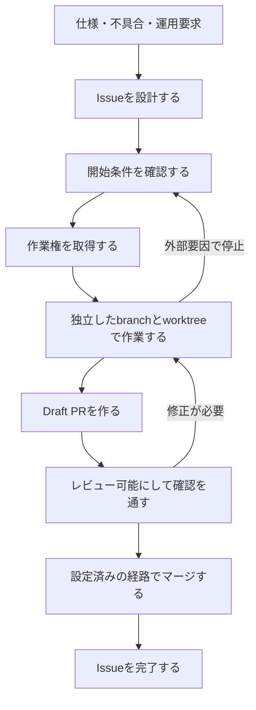

# 目的

GitHub IssueとPRを、Projectの有無に依存しない作業管理の正本として扱う。仕様から作業単位を作り、複数の人やエージェントが二重着手せず、レビュー可能なPRとして完了させるまでの契約を定義する。

# 責務の境界

このスキルが扱うもの:

- Issue分割、Issue本文、Issue Forms
- sub-issue、blocked by / blocking、Milestone
- 作業開始可能性、作業権、引き継ぎ、解放
- `1 Issue = 1 branch = 1 PR` の対応
- PR本文、レビュー可能性、CI確認、マージ

このスキルが扱わないもの:

- GitHub Projectsの作成、フィールド、ビュー、`Status`
- `Effort`、`Estimate Confidence`、WIP上限、`Forecast`、実行Wave
- 通常のコードレビューやCI失敗の修正そのもの

GitHub Projectsを併用する依頼では、先にこのスキルでIssueとPRの契約を決め、その後`github-project-ops`でProject項目、工数、容量、日程を設定する。

# 正本

- 現在の作業契約はIssue本文に置く。
- 親子関係、依存、Milestone、Assignee、branch、PRはGitHub標準メタデータに置く。
- 作業権の競合判定はIssueコメントに置く。
- 時系列の判断、阻害要因、引き継ぎ、解放はIssueコメントに置く。
- 実装差分と確認結果はPRに置く。

Projectや組織Issue Fieldが存在する場合も、その値をIssue本文やPR本文へ重複させない。Projectがないリポジトリへ、新しいラベルや独自状態値を一律に導入しない。既存のリポジトリ規約がある場合は先に読み、衝突する変更を止める。

# 参照先の選び方

必要な資料だけを読む。

| 対象                                         | 読むファイル                             |
| -------------------------------------------- | ---------------------------------------- |
| 仕様からの分割、Issue粒度、本文、Issue Forms | `references/issue-authoring.md`          |
| sub-issue、依存関係、Milestone、一括起票計画 | `references/relations-and-milestones.md` |
| 作業権取得、競合、引き継ぎ、解放、阻害要因   | `references/work-claim.md`               |
| PR本文、Draft、レビュー、CI、マージ          | `references/pr-and-merge.md`             |

# 変更前に確認する値

Issue、PR、関係、Milestoneを変更する前に、GitHub上の実状態を読む。

- `[HOST/]OWNER/REPO`
- 既定ブランチ
- Issue番号、URL、open / closed
- 親Issue、sub-issue、blocked by / blocking
- Milestoneのタイトル、番号、期限
- Assignee、作業権コメント、紐づくbranch、open PR
- PRのDraft状態、head SHA、レビュー、必須チェック、マージ可能性
- ruleset、ブランチ保護、マージキュー、自動マージの設定状態

確認できない値はプレースホルダーのままにし、書き込み前に追加確認する。本文の受け入れ条件、非スコープ、確認手順が不足する場合は、確定版として起票せず下書きとして分ける。

# 道具の使い分け

利用可能ならGitHub MCPを探索、要約、関係確認に使う。利用できない場合、または再現可能な記録が必要な場合は`gh ... --json`で読む。

通常の変更には高水準コマンドを使う。

- `gh issue create` / `gh issue edit`
- `gh issue develop`
- `gh pr create` / `gh pr ready` / `gh pr checks` / `gh pr merge`

高水準コマンドにない操作だけ`gh api`または`gh api graphql`を使う。生の`curl`は使わない。複数件を変更するときも配布スクリプトへ隠さず、Issue作成、関係設定、検証の単位に分けて実行する。

# 基本フロー



作業開始可能とは、受け入れ条件、非スコープ、確認手順があり、未解決の前段Issueや外部阻害要因がなく、既存の作業権、branch、open PRと競合しない状態を指す。Projectの`ready`を前提にしない。

# 作業権の不変条件

1. 作業開始前にIssue、関係、Assignee、作業権コメント、branch、open PRを再取得する。
2. 外部情報を含まない一意な実行IDで作業権取得コメントを作る。この時点ではbranchを作らない。
3. ページングを含めて規約コメントを全件取得し、GitHubサーバー時刻が最古の有効コメントを勝者にする。同時刻ならREST APIの数値コメントIDが小さい方を勝者にする。
4. 勝者だけがAssigneeを更新し、再取得して作業権と競合の不在を確認する。
5. リポジトリ差分を作るIssueだけ、確認後にbranchと独立した`worktree`を作る。

規約コメントは固定マーカー付きの追記専用イベントとし、編集・削除しない。全件取得またはイベント列の解釈に失敗した場合は、勝者を推測せず停止する。

Projectを併用する場合も、この競合判定を正本にする。`Agent Run`や`Status`は勝者確定後にProjectへ同期する派生値である。

# IssueとPRの不変条件

- ブランチ作成型Issueは1つのbranchと1つのPRで閉じられる粒度にする。
- 1つのbranchは1つのPRに対応する。
- PR本文は対応するブランチ作成型Issueを自動クローズキーワードで正確に1件だけ閉じる。
- `epic`は原則branchを持たない。`spike`は調査成果物を閉じるPRを持ってよい。
- IssueタイトルとPRタイトルは、TypeやScopeを接頭辞にせず、何が変わるかを自然な言葉で書く。
- Issue本文とPR本文は利用者の言語に合わせる。日本語では常体を使い、技術用語以外へ不要な英単語を混ぜない。

branch名は既存規約がなければ次を使う。

```text
<issue-number>/<type>-<scope>-<short-slug>
```

# 完了判定

- ブランチ作成型Issue: PRが設定済みの経路でマージされ、受け入れ条件と確認手順を満たし、Issueが閉じている。
- PRなしの調査または作業: Issue本文の成果物と判断を更新し、完了根拠をコメントしてIssueを閉じる。
- `epic`: 必須の子Issueが完了し、epic固有の完了条件を満たしている。

単にPRを作成した、CIが待機中である、またはIssueを閉じたという一事実だけで完了扱いにしない。
