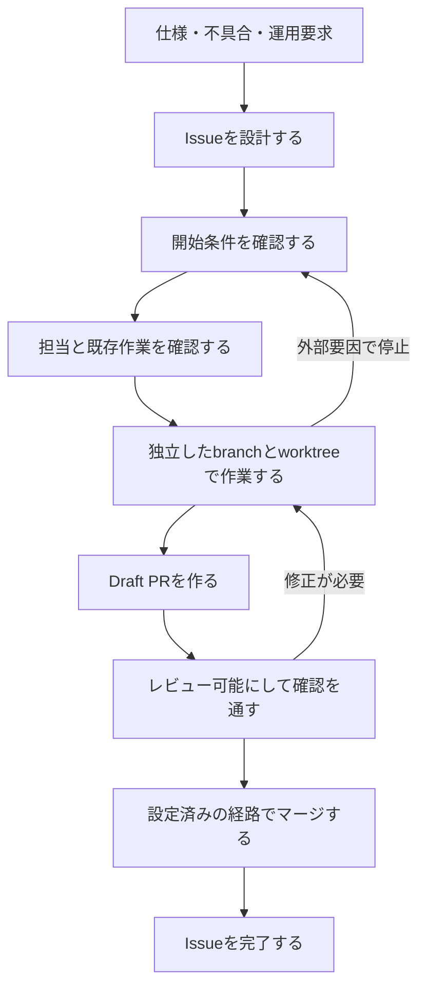

# 目的

GitHub IssueとPRを、Projectの有無に依存しない作業管理の正本として扱う。仕様から作業単位を作り、複数の人やエージェントが二重着手せず、レビュー可能なPRとして完了させるまでの契約を定義する。

# 責務の境界

このスキルが扱うもの:

- Issue分割、Issue本文、Issue Forms
- sub-issue、blocked by / blocking、Milestone
- 作業開始可能性、着手競合、引き継ぎ、中断
- `1 Issue = 1 branch = 1 PR` の対応
- PR本文、レビュー可能性、CI確認、マージ

このスキルが扱わないもの:

- GitHub Projectsの作成、フィールド、ビュー、`Status`
- `Effort`、`Estimate Confidence`、WIP上限、`Forecast`、実行Wave
- 通常のコードレビューやCI失敗の修正そのもの

GitHub Projectsを併用する依頼では、先にこのスキルでIssueとPRの契約を決め、その後`github-project-ops`でProject項目、工数、容量、日程を設定する。

# 正本

- 現在の作業契約はIssue本文に置く。
- 親子関係、依存、Milestone、Assignee、linked branch、PRはGitHub標準メタデータに置く。
- 現在の担当はAssignee、進行中の実装はlinked branchとopen PRから判断する。
- 時系列の判断、阻害要因、引き継ぎ、中断はIssueコメントに置く。ただし、コメントを排他制御や担当決定の正本にはしない。
- 実装差分と確認結果はPRに置く。

Projectや組織Issue Fieldが存在する場合も、その値をIssue本文やPR本文へ重複させない。Projectがないリポジトリへ、新しいラベルや独自状態値を一律に導入しない。既存のリポジトリ規約がある場合は先に読み、衝突する変更を止める。

# 参照先の選び方

必要な資料だけを読む。

| 対象                                                       | 読むファイル                             |
| ---------------------------------------------------------- | ---------------------------------------- |
| 仕様からの分割、Issue粒度、本文、Issue Forms               | `references/issue-authoring.md`          |
| sub-issue、依存関係、Milestone、一括起票計画               | `references/relations-and-milestones.md` |
| ライフサイクルコメント、着手競合、引き継ぎ、中断、阻害要因 | `references/lifecycle-comments.md`       |
| PR本文、Draft、レビュー、CI、マージ                        | `references/pr-and-merge.md`             |
| 発火条件と出力品質の評価                                   | `references/empirical-validation.md`     |

# 変更前に確認する値

Issue、PR、関係、Milestoneを変更する前に、GitHub上の実状態を読む。

- `[HOST/]OWNER/REPO`
- 既定ブランチ
- Issue番号、URL、open / closed
- 親Issue、sub-issue、blocked by / blocking
- Milestoneのタイトル、番号、期限
- Assignee、linked branch、open PR
- PRのDraft状態、head SHA、レビュー、必須チェック、マージ可能性
- ruleset、ブランチ保護、マージキュー、自動マージの設定状態

確認できない値はプレースホルダーのままにし、書き込み前に追加確認する。本文の受け入れ条件、非スコープ、確認手順が不足する場合は、確定版として起票せず下書きとして分ける。

# 道具の使い分け

利用可能ならGitHub MCPを探索、要約、関係確認に使う。利用できない場合、または再現可能な記録が必要な場合は`gh ... --json`で読む。

通常の変更には高水準コマンドを使う。

- `gh issue create` / `gh issue edit`
- `gh issue develop`
- `gh pr create` / `gh pr ready` / `gh pr checks` / `gh pr merge`

高水準コマンドにない操作だけ`gh api`または`gh api graphql`を使う。生の`curl`は使わない。複数件を変更するときも配布スクリプトへ隠さず、Issue作成、関係設定、検証の単位に分けて実行する。

複数Issueの作成計画には、対象リポジトリ、件数、Milestone、全一時キーを含む確認文字列を必ず出力する。利用者の完全一致の同意後だけ、Milestone、Issue、親子・依存関係の順で適用し、各段階で全件を再取得する。失敗時は残りを止め、作成済み番号と未実行項目を報告し、自動削除しない。

# 基本フロー



作業開始可能とは、受け入れ条件、非スコープ、確認手順があり、未解決の前段Issueや外部阻害要因がなく、Assignee、linked branch、open PRに競合がない状態を指す。Projectの`ready`を前提にしない。

# 着手と引き継ぎの不変条件

1. 作業開始、再開、引き継ぎの前にIssue、関係、IssueのAssignee、linked branch、open PRを再取得する。PRのAssigneeやレビュアーは担当決定に使わない。
2. 別の担当や進行中の実装がなく、相互に矛盾しない場合だけ、必要なAssignee更新を行って再取得する。
3. Assignee、linked branch、open PRのどれかが別の担当または別の実装を示す場合は、担当を推測せず、Assignee、branch、PR、Project項目を変更しないで停止する。
4. 競合時は、権限を持つ人間が担当、既存branchとPRの扱い、未push差分の扱いをGitHub上で明示するまで待つ。コメント時刻やコメントIDで担当を自動決定しない。
5. 引き継ぎでは旧担当が変更を止め、人間の決定を通常のコメントで記録する。新担当はGitHub標準メタデータを再取得し、Assigneeを更新して再確認した後にだけ作業を再開する。
6. `worktree`ディレクトリ自体を担当情報として引き継がない。旧担当が未push差分を保存して利用を止めた後、新担当は既存branchを指す自分用の独立した`worktree`を用意する。同じローカル環境で既存`worktree`がbranchを保持している場合は強制解除せず、その扱いが決まるまで停止する。
7. リポジトリ差分を作るIssueだけ、競合がないことを確認した後にlinked branchと独立した`worktree`を作る。既存branchまたはopen PRを引き継ぐ場合は新しく重複作成しない。

Issueコメントは判断の経緯を残す用途に限り、固定マーカー、実行ID、コメント順による所有者判定を導入しない。GitHubの状態を取得できない場合も、担当や競合の不在を推測せず停止する。

Projectを併用する場合、競合解消後のAssignee、linked branch、PRの状態だけを`Agent Run`や`Status`へ同期する。Project側の値からIssueの担当を逆算しない。

# IssueとPRの不変条件

- ブランチ作成型Issueは1つのbranchと1つのPRで閉じられる粒度にする。
- 1つのbranchは1つのPRに対応する。
- PR本文は対応するブランチ作成型Issueを自動クローズキーワードで正確に1件だけ閉じる。
- `epic`は原則branchを持たない。`spike`は調査成果物を閉じるPRを持ってよい。
- IssueタイトルとPRタイトルは、TypeやScopeを接頭辞にせず、何が変わるかを自然な言葉で書く。
- Issue本文とPR本文は利用者の言語に合わせる。日本語では常体を使い、技術用語以外へ不要な英単語を混ぜない。

branch名は既存規約がなければ次を使う。

```text
<issue-number>/<type>-<scope>-<short-slug>
```

`<type>`はIssueの一般分類名ではなく、差分の主目的から選ぶ。

| 主目的                           | `<type>`                                    |
| -------------------------------- | ------------------------------------------- |
| 機能や利用者向け振る舞いの追加   | `feat`                                      |
| 不具合の修正                     | `fix`                                       |
| 文書、整形、内部改善、性能、試験 | `docs`, `style`, `refactor`, `perf`, `test` |
| ビルド、CI、保守、取消し         | `build`, `ci`, `chore`, `revert`            |
| 期限付き調査                     | `spike`                                     |

「通常作業」は`<type>`値ではない。Issue本文と予定差分から主目的を判断できない場合は、`chore`を既定値にせずbranch作成前に停止する。`epic`は原則branchを持たない。

# 完了判定

- ブランチ作成型Issue: PRが設定済みの経路でマージされ、受け入れ条件と確認手順を満たし、Issueが閉じている。
- PRなしの調査または作業: Issue本文の成果物と判断を更新し、完了根拠をコメントしてIssueを閉じる。
- `epic`: 必須の子Issueが完了し、epic固有の完了条件を満たしている。

単にPRを作成した、CIが待機中である、またはIssueを閉じたという一事実だけで完了扱いにしない。
