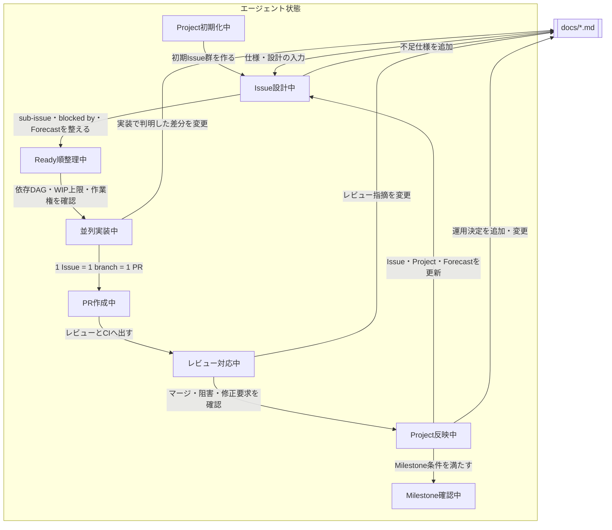

# 目的

GitHub Projectsを作業管理の正本とし、複数人・複数エージェントでIssueを安全に並列処理するためのWBS作成・Issue駆動運用を定義する。

単発のGitHub操作手順ではなく、計画、作業権、容量、Issue/PR契約、完了判定、Project初期構築・解除を一つの運用として扱う。

# 基本原則

SSoTはGitHub上のProject、Issue、PRである。

利用者の言語に合わせて書く。日本語では、GitHubの正式名称、項目名、コマンド、状態値など意味を固定する技術用語だけを英語で残し、説明文へ不要な英単語を混ぜない。

- 計画構造はGitHub Projectsに置く。
- 作業単位はGitHub Issueに置く。
- 親子階層はsub-issueで表す。
- 実行順序はblocked by / blockingで表す。
- リリース、確認点、締切目標はGitHub Milestoneで表す。
- 実装差分はPRで表す。
- 既定ブランチへの統合は、利用可能ならマージキュー、利用不可なら必須ステータスチェック付き保護ブランチで表す。

`assets/` は、対象リポジトリへコピーして使う設定・サンプルデータ、または対象リポジトリに合わせて編集して使うテンプレートを置く。Issue Forms、PRテンプレート、`merge_group` 対応CI、Projectビュー説明、Projectフィールド・ビューJSON、初期Issue一覧JSON、一括作成用テンプレートはここに置く。
Projectフィールドは `assets/project-fields.json`、ビューの作成可能な設定は `assets/project-views.json` を正本にする。作成済みIssueとProject項目値を結ぶ割当計画例は `assets/project-items.example.json` に置く。

`references/` は、エージェントが必要に応じて読む手順、判断基準、テンプレート、記入済み例を置く。テンプレートと例は用途ごとの参照資料内で隣接させる。

このスキルはGitHubを変更する配布スクリプトを持たない。探索と状況整理はGitHub MCPを優先し、通常の変更は `gh`、高水準コマンドにない操作だけ `gh api` または `gh api graphql` で行う。大量設定も段階ごとの明示コマンドで適用し、直後に再取得する。

# 参照先の選び方

必要な参照資料だけを読む。

| 対象                                                                                    | 読むファイル                          |
| --------------------------------------------------------------------------------------- | ------------------------------------- |
| Projectフィールド、工数、容量/WIP、Milestone、Forecast、日付、ビュー、コピー用アセット  | `references/project-setup.md`         |
| Project初期構築、既存Issueの割当、値設定、ビュー、全件検証                              | `references/project-bootstrap.md`     |
| Project紐付け、フィールド、項目値、ビューのページング読取と選択肢更新                   | `references/project-api-queries.md`   |
| WBS分解、Issue粒度、Issue本文、sub-issue、依存DAG、変更競合                             | `references/issue-authoring.md`       |
| Status遷移、作業権、実行Wave、`epic`集約、型別完了、`ready` / `blocked`                 | `references/issue-lifecycle.md`       |
| ライフサイクルコメントを実際に書き込むときだけ                                          | `references/lifecycle-comments.md`    |
| Priority、Size、Complexity、Risk、Effort、Estimate Confidence、Agent Tier、再トリアージ | `references/triage-and-agent-tier.md` |
| PR本文、振る舞い、確認結果、レビュー中の扱い、マージキュー、自動・手動マージ            | `references/pr-and-merge.md`          |
| Project/Milestone解除、Projectアイテム・フィールド・コピー用アセットの削除、復元可能性  | `references/uninstall.md`             |
| 発火条件、出力品質、実行比較の評価                                                      | `references/empirical-validation.md`  |

# 変更前に発見する値

Issue、PR、Projectアイテムを変更する前に、GitHub上の実状態を読む。推測で埋めてよいのは計画案や下書きだけで、実行コマンドに渡す値は確認済みの値にする。

最低限確認する値:

- `OWNER/REPO`
- リポジトリとProjectの所有者種別、公開範囲、契約プラン
- Project番号・所有者
- 既定ブランチ
- 組織Issue Type / Issue FieldとProjectフィールドの正本分担
- マージキューの利用資格、実際の設定状態、代替経路
- ProjectアイテムID
- Milestoneのタイトル・番号・期限
- Issue番号、PR番号、Issue/PR URL
- 親Issue / sub-issue / blocked by / blocking
- Status、Type、Scope、Priority、Size、Effort、Estimate Confidence、Complexity、Risk、Agent Tier
- Assignee、Reviewer Owner、Agent Harness、Agent Model、Agent Run、Branch
- 稼働カレンダー、実装/レビュー/重いCI・共有環境/マージ待ちのWIP上限と予備日

不明な値は `<PROJECT_NUMBER>` のようなプレースホルダーとして明示し、実行前にGitHub MCP、`gh issue view`、`gh pr view`、`gh project item-list`、`gh api` のいずれかで確認する。Issue本文やPR本文の具体化に必要な受け入れ条件、非スコープ、確認手順が足りない場合は、推測で確定せず、下書きとして分けるか追加確認する。

# GitHub MCP / gh CLI / gh apiの使い分け

GitHub MCPは対話的な確認、探索、状況整理、自然言語での操作補助に使う。

- Projectの状態を読む。
- IssueやPRの要約を作る。
- どのIssueを分割するべきか検討する。
- エージェントに実装対象Issueを読ませる。
- PRレビューやCI失敗の原因を整理する。

再現可能な操作はgh CLIで行う。

- Issue作成
- Milestone作成
- IssueへのMilestone割当
- sub-issue設定
- blocked by / blocking設定
- 紐づくブランチ作成
- PR作成
- 自動マージ投入

gh CLIの高水準コマンドで足りない場合だけ、`gh api` または `gh api graphql` を使う。生のcurl POSTは使わない。

# エージェント運用フロー



初回一括設定は導入時だけに使う。既存Projectの運用ではIssue設計中から始める。運用中の変更は以前の計画をそのまま再適用せず、GitHub上の実状態を読んでIssue、Project、Milestoneを個別に更新する。

`docs/*.md` は固定の前提ではなく、Issue設計中、並列実装中、レビュー対応中、Project反映中に追加・変更する対象である。

Projectフィールド更新では状態、Effort、Estimate Confidence、予定開始日、予定終了日、実開始日、実終了日、ブランチ、エージェント実行環境、モデル、Agent Run、レビュー責任者を扱う。これらの管理情報をIssue本文やPR本文へ複製しない。

# Issue / PRの不変条件

1つのブランチ作成型Issueは1つのブランチを持つ。1つのブランチは1つのPRに対応する。PR本文は `Closes #<issue-number>`、`Fixes #<issue-number>`、`Resolves #<issue-number>` のいずれかで、対応するブランチ作成型Issueを正確に1件だけ閉じる。

`epic` Issueは原則ブランチを持たない。`spike` Issueは調査成果物を閉じるPRを持ってよい。

IssueタイトルとPRタイトルは、Conventional Commits風にしない。TypeとScopeは選択した正本へ書くため、タイトルには書かない。タイトルには、何ができるようになるか、何が直るかを自然な日本語で書く。

Issue本文とPR本文は常体で書く。論文やレポートと同じく「である」「する」「できる」を使い、丁寧体は使わない。

Issue本文やPR本文で既存Issue/PRやコミットを参照するときは、同一リポジトリなら `#123` や短いコミットSHAだけを書く。GitHubが自動リンクとホバー表示で参照先を表示するため、タイトルを併記しない。

ブランチ名は読みやすさと自動化を優先し、次の形式にする。

```text
<issue-number>/<type>-<scope>-<short-slug>
```

例:

```text
123/feat-ui-seekbar-chapters
124/fix-db-work-time-offset
125/docs-ops-ci-rules
```

Issueタイトルとブランチ名を一致させる必要はない。

# Projectメタデータ方針

このスキルではGitHubラベルを使わない。リポジトリが組織所有なら、利用できる組織Issue Typeと組織Issue Fieldを先に読む。Typeは正規Type一式が揃う場合だけ組織Issue Typeを使い、それ以外はProject Typeを使う。Type以外のIssue Fieldはフィールドごとに同名・同型・同じ選択肢・必要な公開範囲を確認し、一致するフィールドだけを正本にする。対応フィールドが存在しない場合はProjectフィールドへ切り替える。権限不足、同名定義の衝突、公開範囲の不一致、確認不能では推測せず停止する。Statusは常にProjectフィールドに置く。

Source、Priority、Size、Effort、Estimate Confidence、Complexity、Risk、Agent Tierなどは、上記のフィールドごとの正本判定結果に従う。

組織Issue FieldまたはProjectフィールドを正本にしたメタデータはIssue本文、PR本文へ書かない。sub-issue、blocked by / blockingもGitHubメタデータをSSoTにし、Issue本文にsub-issue一覧や依存関係の節として重複させない。Issue本文には検証可能な最新情報だけを書く。作業権取得コメントだけは競合解決と監査のため、外部情報を含まない実行IDをAgent Runと重複してよい。非公開タスクURLは書かない。

Issue時点では具体的なモデル名まで確定させず、Agent Tierを設定する。作業権取得成功時にAgent Harness、Agent Model、Agent Runを、それぞれ選択した正本へ記録する。

# Milestone方針

MilestoneはProjectフィールドではなく、GitHub標準のMilestoneを使う。Milestoneの期限を先に決め、その締切目標からIssue/WBSのForecast Start / Forecast Endを組む。IssueのForecastからMilestone期限を逆算しない。

締切未定のMilestoneは必要に応じて期限なしで作ってよい。Issue本文、PR本文、ProjectフィールドにはMilestone期限を複製しない。

# Issueのライフサイクル

`ready` は「仕様が確定している」ではなく「今すぐ作業開始できる」という意味で使う。未解決の `blocked by` が作業開始を止めるIssueは `ready` にしない。

`blocking` は「このIssueが後続Issueの前提である」という関係であり、`ready` と両立する。`blocked by` は「このIssueが前段Issueを待っている」というIssue間関係であり、未解決なら `blocked` にする。

Statusは `blocked by` / `blocking` から自動同期しない。`blocked` には上流PR、Figmaデザイン、権限、担当外のCI基盤障害、設計判断待ちなど、GitHub Issue間の依存関係では表せない阻害要因も含む。Issue間の依存関係は構造、Statusはかんばん上の運用状態として扱う。

`epic` Issueは原則ブランチを持たないため、`ready` にしない。`epic` のStatusは子Issue群の進行状態を要約する。

Typeの値域は `assets/project-fields.json`、Typeの保存先選択は `references/project-setup.md` を正本にする。Status遷移、`blocked` の判定、型別完了、再開・取消条件は `references/issue-lifecycle.md` を読む。Priority、Size、Complexity、Risk、Effort、Estimate Confidence、Agent Tierは `references/triage-and-agent-tier.md` を正本にする。`needs-info` と `ready-to-merge` は使わない。

作業開始時の必須操作:

1. `blocked by`、外部の阻害要因、未終了PR、Branch、Agent Run、Assigneeを再取得する。
2. 実装WIPと下流のレビュー・CI・マージ待ちWIPに空きがあることを確認する。
3. 作業権取得コメントを作り、GitHubサーバー時刻で最古の有効コメントだけを勝者にする。
4. 勝者だけがAgent Run、Agent Harness、Agent Model、Assigneeを設定し、再取得して実行IDを確認する。
5. Issueを `in-progress` にしてActual Startを設定する。
6. 実行ID確認後、リポジトリ差分を作るIssueだけ紐づくブランチと独立した`worktree`を作る。

作業権取得、引き継ぎ、無効判定、実行Wave、型別完了の詳細は `references/issue-lifecycle.md` を読む。コメントを書き込む時だけ `references/lifecycle-comments.md` を追加で読む。

# マージ方針

既定ブランチへの統合方式は、所有形態や契約プランだけで決めない。ruleset、ブランチ保護、必須ステータスチェック、CI起動条件、設定権限を読み、マージキューまたは保護ブランチ経路が実際に強制されていることを確認する。確認不能、またはどちらも強制できない場合は作業権取得前に停止する。

標準はマージコミットであり、既定ブランチへ直接pushしない。マージキュー対応時はPRと `merge_group` の必須ステータスチェックを使う。非対応時は検証済みの保護ブランチ経路を使い、自動マージも使えなければ保護を迂回せず手動マージする。具体的な判定とコマンドは `references/pr-and-merge.md` を読む。
