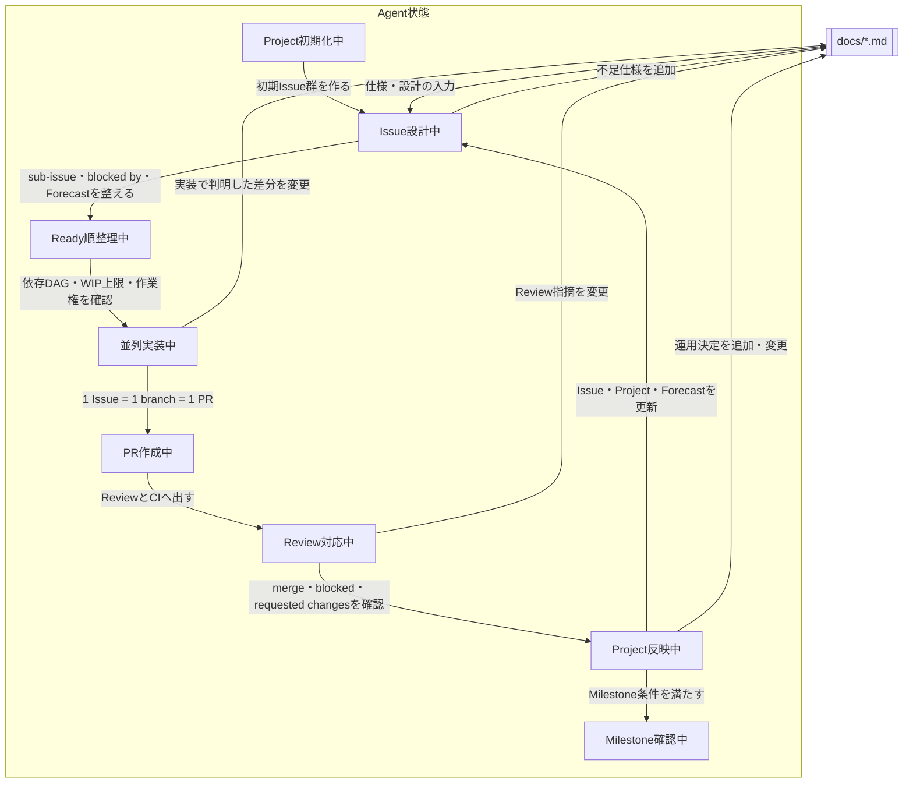
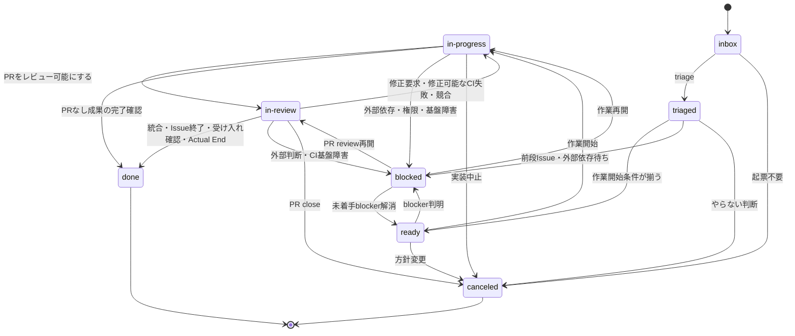

# 目的

Agentで効率的に並列Issue処理することを前提とした、GitHub Projectsを使ったWBS作成とアジャイルIssue駆動開発のためのskill。

このskillは、複数人と複数agentがタスク管理のSSoTとしてGitHub Projects、Issues、sub-issues、blocked by/blocking、PR、マージキューを使うための運用規約を定義する。

# 基本原則

SSoTはGitHub上のProject、Issue、PRである。

- 計画構造はGitHub Projectsに置く。
- 作業単位はGitHub Issueに置く。
- 親子階層はsub-issueで表す。
- 実行順序はblocked by / blockingで表す。
- リリース、確認点、締切目標はGitHub Milestoneで表す。
- 実装差分はPRで表す。
- 既定ブランチへの統合は、利用可能ならマージキュー、利用不可なら必須検査付き保護ブランチで表す。

`assets/` は、対象リポジトリへコピーして使う設定・サンプルデータ、または対象リポジトリに合わせて編集して使うテンプレートを置く。Issue Forms、PRテンプレート、`merge_group` 対応CI、Projectビュー説明、Project項目・ビューJSON、初期Issue一覧JSON、一括作成用テンプレートはここに置く。
Project項目は `assets/project-fields.json`、ビューの作成可能な設定は `assets/project-views.json` を正本にし、一括作成テンプレートは両方のJSONを読む。

`references/` は、agentが必要に応じて読む手順、判断基準、template、記入済み例を置く。templateと記入済み例はuse-caseごとのreference内で隣接させる。

このskillはそのまま実行するturnkey shell scriptを配らない。GitHubの実操作は、GitHub MCPで実状態を確認してから `gh` / `gh api` の明示コマンドで行う。大量WBS起票では `assets/project-bootstrap-template.py` を対象repository向けに編集して使ってよい。

# Reference routing

必要なreferenceだけを読む。

| Task                                                                                               | Read                                  |
| -------------------------------------------------------------------------------------------------- | ------------------------------------- |
| Project fields、Effort、容量/WIP、Milestone、Forecast、date fields、views、copyable assets         | `references/project-setup.md`         |
| Project作成、Milestone作成、bulk WBS setup、Project item field一括設定、GraphQL fallback、template | `references/project-bootstrap.md`     |
| WBS分解、Issue粒度、Issue本文、sub-issue、依存DAG、変更競合グラフ                                  | `references/issue-authoring.md`       |
| Status遷移、作業権取得、実行Wave N、epic状態集約、型別完了、`ready` / `blocked` 判断               | `references/issue-lifecycle.md`       |
| ライフサイクルコメントを書き込むときだけ                                                           | `references/lifecycle-comments.md`    |
| Priority / Size / Complexity / Risk / Effort / Confidence / Agent Tier / 再トリアージ              | `references/triage-and-agent-tier.md` |
| PR本文テンプレート、振る舞い、テストケース、in-reviewコメント方針、マージキュー、自動マージ        | `references/pr-and-merge.md`          |
| Project/Milestone解除、Project item削除、repo側copyable assets削除、破壊的削除の確認               | `references/uninstall.md`             |
| skill本文、references、assetsの経験的検証                                                          | `references/empirical-validation.md`  |

# 変更前に発見する値

Issue、PR、Project itemを変更する前に、GitHub上の実状態を読む。推測で埋めてよいのは計画案や下書きだけで、実行コマンドに渡す値は確認済みの値にする。

最低限確認する値:

- `OWNER/REPO`
- リポジトリとProjectの所有者種別、公開範囲、契約プラン
- Project number / owner
- 既定ブランチ
- 組織Issue Type / Issue FieldとProject fieldの正本分担
- マージキューの利用資格、実際の設定状態、代替経路
- Project item ID
- Milestone title / number / due date
- Issue number、PR number、Issue/PR URL
- parent / sub-issue / blocked by / blocking
- Status、Type、Scope、Priority、Size、Effort、Estimate Confidence、Complexity、Risk、Agent Tier
- Assignee、Reviewer Owner、Agent Harness、Agent Model、Agent Run、Branch
- 稼働カレンダー、実装/レビュー/重いCI・共有環境/マージ待ちのWIP上限と予備日

不明な値は `<PROJECT_NUMBER>` のようなplaceholderとして明示し、実行前にGitHub MCP、`gh issue view`、`gh pr view`、`gh project item-list`、`gh api` のいずれかで確認する。Issue本文やPR本文の具体化に必要な受け入れ条件、非スコープ、確認手順が足りない場合は、推測で確定せず、draftとして分けるか追加確認する。

# GitHub MCP / gh CLI / gh apiの使い分け

GitHub MCPは対話的な確認、探索、状況整理、自然言語での操作補助に使う。

- Projectの状態を読む。
- IssueやPRの要約を作る。
- どのIssueを分割するべきか検討する。
- agentに実装対象Issueを読ませる。
- PRレビューやCI失敗の原因を整理する。

再現可能な操作はgh CLIで行う。

- Issue作成
- Milestone作成
- IssueへのMilestone割当
- sub-issue設定
- blocked by / blocking設定
- 紐づくブランチ作成
- PR作成
- 自動マージ投入

gh CLIの高水準コマンドで足りない場合だけ、`gh api` または `gh api graphql` を使う。生のcurl POSTは使わない。

# エージェント運用フロー



初回一括作成は導入時だけに使う。既存Projectの運用ではIssue設計中から始める。運用中の変更は一括作成ひな形の再実行で吸収せず、GitHub上の実状態を読んでIssue、Project、Milestoneを個別に更新する。

`docs/*.md` は固定の前提ではなく、Issue設計中、並列実装中、Review対応中、Project反映中に追加・変更する対象である。

プロジェクト項目更新では状態、Effort、Estimate Confidence、予定開始日、予定終了日、実開始日、実終了日、ブランチ、エージェント実行環境、モデル、Agent Run、レビュー責任者を扱う。これらの管理情報を課題本文やプルリクエスト本文へ複製しない。

# Issue / PR invariants

1つのブランチ作成型Issueは1つのブランチを持つ。1つのブランチは1つのPRに対応する。PR本文は `Closes #<issue-number>`、`Fixes #<issue-number>`、`Resolves #<issue-number>` のいずれかで、対応するブランチ作成型Issueを正確に1件だけ閉じる。

epic issueは原則ブランチを持たない。spike issueは調査成果物を閉じるPRを持ってよい。

IssueタイトルとPRタイトルは、Conventional Commits風にしない。TypeとScopeは選択した正本へ書くため、タイトルには書かない。タイトルには、何ができるようになるか、何が直るかを自然な日本語で書く。

Issue本文とPR本文は常体で書く。論文やレポートと同じく「である」「する」「できる」を使い、丁寧体は使わない。

Issue本文やPR本文で既存Issue/PRやコミットを参照するときは、同一repositoryなら `#123` や短いコミットSHAだけを書く。GitHubが自動リンクとホバー表示/プレビューで参照先を表示するため、titleを併記しない。

ブランチ名は読みやすさと自動化を優先し、次の形式にする。

```text
<issue-number>/<type>-<scope>-<short-slug>
```

例:

```text
123/feat-ui-seekbar-chapters
124/fix-db-work-time-offset
125/docs-ops-ci-rules
```

Issue titleとブランチ名を一致させる必要はない。

# Projectメタデータ方針

このスキルではGitHubラベルを使わない。リポジトリが組織所有なら、利用できる組織Issue Typeと組織Issue Fieldを先に読む。Typeは正規Type一式が揃う場合だけ組織Issue Typeを使い、それ以外はProject Typeを使う。Type以外のIssue Fieldは項目ごとに同名・同型・同じ選択肢・必要な公開範囲を確認し、一致する項目だけを正本にする。対応項目が存在しない場合はProject項目へ切り替える。権限不足、同名定義の衝突、公開範囲の不一致、確認不能では推測せず停止する。Statusは常にProject項目に置く。

Source、Priority、Size、Effort、Estimate Confidence、Complexity、Risk、Agent Tierなどは、上記の項目ごとの正本判定結果に従う。

組織Issue FieldまたはProject項目を正本にしたメタデータはIssue本文、PR本文へ書かない。sub-issue、blocked by / blockingもGitHubメタデータをSSoTにし、Issue本文にsub-issue一覧や依存関係の節として重複させない。Issue本文には検証可能な最新情報だけを書く。作業権取得コメントだけは競合解決と監査のため、外部情報を含まない実行IDをAgent Runと重複してよい。非公開タスクURLは書かない。

Issue時点では具体的なモデル名まで確定させず、Agent Tierを設定する。作業権取得成功時にAgent Harness、Agent Model、Agent Runを、それぞれ選択した正本へ記録する。

# Milestone policy

MilestoneはProject項目ではなく、GitHub標準のMilestoneを使う。Milestoneの期限を先に決め、その締切目標からIssue/WBSのForecast Start / Forecast Endを組む。IssueのForecastからMilestone期限を逆算しない。

締切未定のMilestoneは必要に応じて期限なしで作ってよい。Issue本文、PR本文、Project項目にはMilestone期限を複製しない。

# Typeの定義

TypeはConventional Commitsのtype集合に `epic` と `spike` を足す。

- `epic`: 複数Issueの親。原則PRを持たない。
- `feat`: ユーザー価値または運用価値を追加する。
- `fix`: 期待動作から外れた不具合を直す。
- `docs`: ドキュメントだけを変更する。
- `style`: 挙動を変えない整形、フォーマット、命名微修正。
- `refactor`: 挙動を変えず構造を改善する。
- `perf`: 性能改善。
- `test`: テスト追加・修正。
- `build`: build system、依存解決、packaging。
- `ci`: CI/CD、ブランチ保護、マージキュー、ワークフロー。
- `chore`: 開発補助、掃除、非機能的メンテナンス。
- `revert`: 既存変更のrevert。
- `spike`: 実装前調査、設計検証、技術検証。成果物と次Issueを作る。

# Issueのライフサイクル

`ready` は「仕様が確定している」ではなく「今すぐ作業開始できる」という意味で使う。未解決の `blocked by` が作業開始を止めるIssueは `ready` にしない。

`blocking` は「このIssueが後続Issueの前提である」という関係であり、`ready` と両立する。`blocked by` は「このIssueが前段Issueを待っている」というIssue間関係であり、未解決なら `blocked` にする。

Statusは `blocked by` / `blocking` から自動同期しない。`blocked` にはupstream PR、Figma design、権限、担当外のCI基盤障害、設計判断待ちなど、GitHub Issue間の依存関係では表せない阻害要因も含む。Issue間の依存関係は構造、Statusはかんばん上の運用状態として扱う。

epic issueは原則ブランチを持たないため、`ready` にしない。epicのStatusは子Issue群の進行状態を要約するroll-upとして扱う。

標準Status:



`needs-info` と `ready-to-merge` は使わない。更新負荷が高く、agent運用で状態が細かくなりすぎるため。

作業開始時の必須操作:

1. `blocked by`、外部blocker、open PR、Branch、Agent Run、Assigneeを再取得する。
2. 実装WIPと下流のreview/CI/merge WIPに空きがあることを確認する。
3. 作業権取得コメントを作り、GitHub server timestampで最古の有効コメントだけを勝者にする。
4. 勝者だけがAgent Run、Agent Harness、Agent Model、Assigneeを設定し、再取得して実行IDを確認する。
5. Issueをin-progressにしてActual Startを設定する。
6. 実行ID確認後、リポジトリ差分を作るIssueだけlinked branchと独立worktreeを作る。

作業権取得、引き継ぎ、無効判定、実行Wave N、型別完了の詳細は `references/issue-lifecycle.md` を読む。コメントを書き込む時だけ `references/lifecycle-comments.md` を追加で読む。

# マージ方針

既定ブランチへの統合方式は、対象リポジトリの能力確認後に決める。

- マージコミットを使う。
- squashマージとrebaseマージは標準運用では使わない。
- Require linear historyは使わない。
- 既定ブランチへ直接pushしない。
- マージキューを利用できる場合は、PR単体CIと `merge_group` CIを両方走らせ、承認済みPRに自動マージを設定する。
- マージキューを利用できない場合は、保護ブランチまたはrulesetでPR、必須レビュー、必須検査、会話解決を強制する。通常の自動マージも利用できなければ、条件を再確認した権限保持者が保護を迂回せず手動マージする。
- 所有形態と契約プランから分かるのは利用資格だけである。ruleset、ブランチ保護、必須検査、CI起動条件を読み、推奨方式が実際に設定済みと確認するまでIssueを投入しない。どちらの保護方式も強制できない場合は停止する。
- マージキューのMaximum group sizeは100を許容する。ただしCIを1回にまとめる設定ではない。
