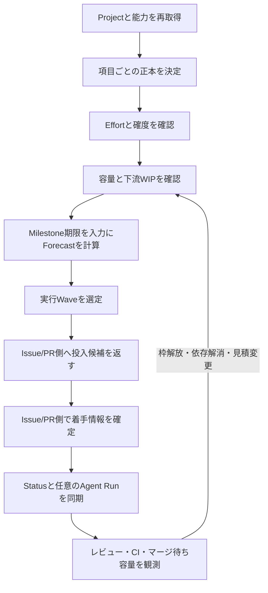

# 目的

GitHub Projectを計画と実行管理の正本にし、項目、工数、容量、日程、実行Waveを一貫して扱う。

利用者の言語に合わせて書く。日本語では、GitHubの正式名称、項目名、状態値、コマンドなど、意味を固定する語だけを英語で残す。

# 責務の境界

このスキルが所有するもの:

- Projectの作成、リポジトリとの紐付け、監査、解除
- Projectアイテム、Projectフィールド、ビュー、`Status`
- 組織Issue Type、組織Issue Field、Projectフィールドの正本分担
- `Effort`、`Estimate Confidence`、容量、WIP上限、`Forecast`
- 実行Waveと、実装・作業環境・レビュー・重いCI・共有環境・マージ待ちの容量
- Issue/PR側で確定済みの着手情報を`Status`へ同期し、現在の実行環境が提示した追跡値があれば`Agent Run`へ記録する派生処理

このスキルが所有しないもの:

- Issueの分割、本文、Issue Forms、sub-issue、blocked by / blocking、Milestoneの作成や変更
- `Assignee`の決定、linked branchの作成・選択、open PRの関連付け、着手競合の解消
- branch、worktree、Issue、PRの対応、PR本文、レビュー契約、マージ方法
- 通常のコードレビュー、CI失敗の修正、IssueやPRの要約、担当者変更、単発コマンドの案内

Issue/PRとProjectの両方を変更する依頼では、先に`github-issue-pr-ops`で作業単位、関係、Milestone、PR契約、着手情報を確定し、このスキルでProject項目、工数、容量、日程を割り当てる。スキル間でファイルやコードを共有せず、GitHub上のIssue番号、URL、node IDと、GitHubから確認できる着手情報だけを受け渡す。

# 道具と正本

- 探索と状況整理はGitHub MCPを優先する。
- MCPに必要な機能がなければ、`gh ... --json`で再現可能な読取記録を残す。
- 通常の変更は`gh project`で行う。
- 高水準コマンドにない読取や変更だけ`gh api`または`gh api graphql`を使う。
- 変更計画には、各段階で使うGitHub MCP、`gh project`、`gh api`、`jq -e`の経路を明記する。「取得する」「更新する」だけの抽象的な手順で済ませない。
- GitHubを変更する新しいスクリプトを生成・配布しない。大量設定も段階ごとの明示コマンドで実行し、毎回再取得する。
- `assets/project-fields.json`をProjectフィールド定義、`assets/project-views.json`をビュー定義の正本にする。
- 作成済みIssueとProject項目値を`assets/project-items.example.json`の形式で結び、タイトルではなくIssue番号、URL、node IDを使う。

# 参照先

必要な資料だけを読む。

| 対象                                                                      | 読むファイル                          |
| ------------------------------------------------------------------------- | ------------------------------------- |
| Projectフィールド、正本分担、工数、容量、Forecast、ビュー                 | `references/project-setup.md`         |
| Project作成、既存Issueの追加、項目値、ビュー、全件検証                    | `references/project-bootstrap.md`     |
| GraphQLのページング読取、項目値、Issue Field値、選択肢更新                | `references/project-api-queries.md`   |
| `Status`同期、WIP上限、実行Wave、容量不足時の停止                         | `references/project-execution.md`     |
| Priority、Size、Complexity、Risk、Effort、Estimate Confidence、Agent Tier | `references/triage-and-agent-tier.md` |
| Project運用の解除、書出し、復元可能性                                     | `references/uninstall.md`             |
| 発火条件と出力品質の評価                                                  | `references/empirical-validation.md`  |

# 変更前に確認する値

書き込み前に、少なくとも次をGitHubから再取得する。

- `OWNER/REPO`、リポジトリnode ID、Project所有者の種別
- Projectの所有者、番号、node ID、URL、公開範囲、開閉状態
- リポジトリとProjectの紐付け
- Project内の全アイテム種別、Issue番号、URL、node ID、ProjectアイテムID
- 組織Issue Type、組織Issue Field、Projectフィールドの名前、型、選択肢、ID、公開範囲
- Projectの全ビューと、APIで取得できる設定
- `Status`、`Effort`、`Estimate Confidence`、`Forecast Start`、`Forecast End`
- 稼働日、1枠あたりの有効Effort、各WIP上限、予備日
- Milestone期限、sub-issue、blocked by / blocking、関連PRの状態。ただし読取入力として扱う
- 同期時は、Issue番号、URL、node ID、`Assignee`、linked branch、open PR、現在の実行環境が提示した公開可能なIDまたはURL（あれば）

プレースホルダー、対象不一致、全ページ取得不能、権限不足、同名異型、正本衝突、未確認値があれば書き込まない。

# 停止時の報告

変更前に停止する場合は、次を1つの報告にまとめる。

- 取得できない値、衝突、対象外アイテム、権限、公開範囲、容量の各停止理由
- Projectアイテムや既存値を自動削除・上書きしないこと
- Issue本文、Milestone、sub-issue、依存関係、Issue Forms、PRテンプレート、CI設定を変更しないこと
- `Status`はProjectフィールドを正本とし、その他は項目ごとに正本を決めること
- 権限取得、正本決定、対象の分離または限定、容量確定後に、「探索、計画、確認、適用、再取得」の探索からやり直すこと

# 運用フロー

Issue/PR側は、`Assignee`、linked branch、open PRが同じ着手を示すことを確認してから着手情報を確定する。Project側は、その情報とGitHub上の対象Issueを照合して`Status`を更新する。`Agent Run`は作業権の根拠ではなく、現在の実行環境が明示した公開可能なIDまたはタスクURLを任意で記録する追跡値である。値がなければ空欄のまま`Status`だけを同期し、推測して作らない。既存値と提示値が異なる場合は、確認済みの担当変更でない限り上書きせず停止する。候補が複数ある、識別子が一致しない、または現在のGitHub状態と矛盾する場合も、Project側で採用候補を決めず同期を停止する。`Assignee`、branch、PRは変更しない。

# 状態・容量・日程

- `Status`は常にProjectフィールドを正本にする。
- 組織Issue TypeとIssue Fieldは、同名、型、選択肢、公開範囲が一致する項目だけ採用する。
- `Effort`は作業量、WIPは同時処理数として分ける。Sizeを合計しない。
- 実装WIPはAgent枠と作業環境枠の小さい方に制限する。
- 容量設定が存在しないことを確認できた場合だけ、安全側の初期値を明記して使える。権限不足や取得失敗で未設定か判定できない場合は、日程・実行Wave・投入を確定せず書き込み前に停止する。
- レビュー、重いCI、共有環境、マージ待ちのいずれかが上限なら、新規投入を止める。
- 実依存で進めないIssueだけ`blocked`にする。容量待ちや変更競合待ちは`ready`のまま投入候補から外す。
- Milestone期限はIssue/PR側の正本から読み、`Forecast`の入力にする。このスキルから期限や割当を変更しない。
- 枠解放、依存解消、工数・確度の変更、Milestone期限の変更を検出したら`Forecast`と実行Waveを再計算する。

# 変更と検証

各段階を「探索、計画、確認、適用、再取得」に分ける。複数段階を1つのコマンド列へ隠さない。途中失敗時は自動削除で巻き戻さず、成功済みIDと未実行項目を記録して実状態から再計画する。

変更後は、代表例ではなく対象全件について次を確認する。

- Projectの同一性、公開範囲、紐付け
- フィールドの名前、型、選択肢、色、説明、正本経路
- 計画した全Issue URLとProjectアイテムID
- 採用した正本上の全項目値
- 全ビューの名前、レイアウト、絞り込み条件
- 画面でしか確認できないビュー設定
- 同期対象の`Status`と、提示された場合だけ`Agent Run`

# Project運用の解除

解除対象はProject本体、紐付け、Projectアイテム、Project独自フィールド、ビュー、コピー済み`.github/project/views.md`だけである。Issue、PR、Milestone、sub-issue、blocked by / blocking、Issue Forms、PRテンプレート、CIは変更も削除もしない。

解除前にProjectの全状態をJSONへ書き出し、モード、対象、件数、復元可能性を示して明示確認を得る。詳細は`references/uninstall.md`に従う。
