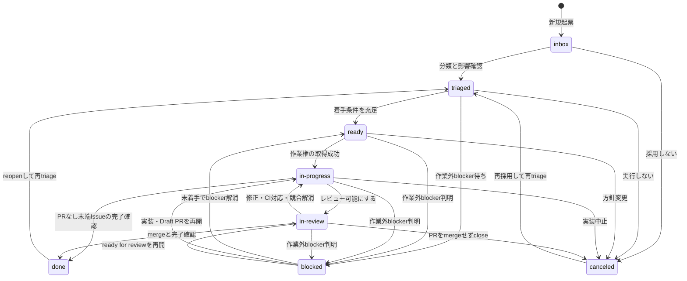

# Issueのライフサイクル

Status遷移、実行Wave、作業権の取得、再開、完了判定を扱うときに読む。コメントの書式と例は
[`lifecycle-comments.md`](lifecycle-comments.md) を読む。

# 目次

- Statusの意味
- 状態遷移
- Type別のdone条件
- Epic状態の集約
- 実行Wave Nの組み立て
- Agent Runの作業権取得手順
- Status別の判定
- 再開と投入見送り

# Statusの意味

Statusは仕様の成熟度ではなく、次に実行できる操作を表す。

| Status        | 意味                                                                 |
| ------------- | -------------------------------------------------------------------- |
| `inbox`       | 未整理の流入                                                         |
| `triaged`     | 分類済みだが、着手条件または投入順が未確定                           |
| `ready`       | 実行対象の末端Issueで、作業権を取得すれば直ちに開始できる            |
| `in-progress` | 作業権を取得済みで、実装、修正、またはDraft PRを更新している         |
| `in-review`   | PRがレビュー可能で、通常のレビューまたはCI完了を待っている           |
| `blocked`     | 当該作業の外にある阻害要因のため、担当者が今すぐ進められる操作がない |
| `done`        | Type別の完了条件を満たした                                           |
| `canceled`    | 実行しない判断を記録して終了した                                     |

`needs-info` と `ready-to-merge` は使わない。`blocking` と `blocked by` はStatusではなくIssue関係である。StatusはIssue関係から自動同期しない。

`blocked` は、前段Issue、上流PR、権限、外部設計、外部サービス、担当外の判断など、当該担当者が局所的な変更では解除できない阻害要因に限る。レビュー修正依頼、修正可能なCI失敗、解消可能なマージ競合は実行できる作業なので `in-progress` に戻す。単なるレビュー/CI待ちは `in-review` のままにする。

# 状態遷移

Draft PRを作っただけでは `in-review` にしない。Draft PRは `in-progress`、レビュー可能状態（Ready for review）へ変更して通常のレビューを依頼した時点で `in-review` にする。

# Type / 成果種別ごとの完了条件

正規のTypeと成果の形に応じて、PRマージを必須にするかを変える。固有条件を満たしたIssueを完了候補にし、最後に共通のProject fieldを更新する。

| 成果種別           | 固有の完了条件                                                                                                         |
| ------------------ | ---------------------------------------------------------------------------------------------------------------------- |
| ブランチ作成型     | PRがdefault branchへマージ済みでrequired checksが成功し、受け入れ条件を確認済み                                        |
| spike              | 設定した時間枠、問いへの結論、証拠、採用/棄却案、後続Issueまたは不要理由が揃う。コード成果がある場合だけPRマージも必須 |
| リポジトリ差分なし | 外部操作または意思決定が完了し、検証証拠とロールバック/後片付けの状態が揃う。PR不要の理由をIssueへ明示する             |
| epic               | epicの完了条件を満たし、必要な末端Issueがすべて `done`、または不要化/置換を明示承認した `canceled` で、残作業がない    |

全種別でIssueのclose、Actual End、Status `done` を必須にする。Agent Runは最終実行の追跡用に残す。リポジトリ内のdocs変更は通常ブランチ作成型であり、「docsだからリポジトリ差分なし」とは判定しない。

- ブランチ作成型は、`feat` / `fix` / `docs` / `style` / `refactor` / `perf` / `test` / `build` / `ci` / `chore` / `revert` でリポジトリ差分を作る場合である。
- リポジトリ差分なしは、`docs` / `ci` / `chore` / `spike` などでもリポジトリ差分を作らず、外部操作や意思決定だけを行うとIssueに明示した場合である。

spikeを「コードを書かなかったから未完了」にしない。反対に、設定した時間枠が切れただけで結論、証跡、後続Issueがないspikeはdoneにしない。

# Epic状態の集約

epicは原則branchと作業権を持たず、`ready` にしない。必要な末端Issueを正として、次の優先順位で上から最初に該当するStatusを選ぶ。

1. epic自体を明示的に中止したなら `canceled`。
2. epic固有の完了条件を満たしたなら `done` 候補とし、Issue close、Actual End、Statusを更新する。
3. 未完了の必須末端Issueがあり、`ready` / `in-progress` / `in-review` が0件で、実際の阻害要因があるなら `blocked`。
4. `in-progress` / `in-review` / `done` の必須末端Issueが1件以上あるなら `in-progress`。
5. 分割済みで着手待ちなら `triaged`。
6. 未トリアージなら `inbox`。

canceledの末端Issueは自動的に達成扱いにしない。不要化または置換をepicの完了判定で明示承認する。epicのEffortとEstimate Confidenceは空欄にし、末端IssueのEffortだけを集計する。epic本文には目的、境界、完了条件、状態集約の根拠を残し、子一覧はGitHub sub-issue metadataを参照する。

# 実行Wave Nの組み立て

ready候補がなくなるまで `Wave 1`、`Wave 2`、…、`Wave N` を必要な長さだけ組み立てる。Waveは投入計画であり、論理依存を隠す仕組みではない。

## 1. 候補グラフを検証する

- 前段の成果を必要とするIssueはGitHubの `blocked by` で結ぶ。
- 自己参照と循環依存を拒否し、依存グラフをDAGにする。
- `canceled` な前段Issueがあっても後続の阻害が自動的に解消したとはみなさない。代替成果物を確認し、依存を外すか別Issueへ張り替える。
- 推移的な依存関係を確認し、直接の前段だけでなく下流全体への影響を見積もる。
- `変更ファイル` が重なるIssueは論理依存にしない。変更競合として同一Waveへの投入可否、workspace分離、merge順を判断する。

## 2. 有限WIPへ配置する

実行Waveごとに、Project運用設定の上限を読む。未設定時は各1として安全側に扱い、無制限agentを前提にしない。

- 実装枠: 同時に作業権を取得し、独立したworktreeで作業できるIssue数。
- レビュー枠: 同時にレビューへ流せるPR数。
- 重いCI・共有環境枠: 同時実行できる重いcheck、merge_group、共有fixture検証の数。
- マージ待ち枠: 同時に自動マージまたはmerge queueへ置けるPR数。

Effortは稼働日上の所要期間計算に使い、WIPは同時処理数に使う。SizeはPR/レビュー量の順序尺度であり合算しない。下流枠が上限なら、新しい実装作業権を取得せず、上流への投入を抑える。

`in-review` の件数だけでは下流WIPを区別できないため、実行Waveの再計算時に紐づくPRのメタデータを読む。

- 未承認または未解決の会話あり: レビュー枠を消費する。
- `重いCI` と指定した検査または共有環境検証が実行中: 重いCI・共有環境枠を消費する。通常の軽いCIだけなら専用枠を消費しない。
- 承認と必須検査が完了し、自動マージまたはマージキュー待ち: マージ待ち枠を消費する。
- PRなしspike/リポジトリ差分なし: 実装枠だけを使い、実際にPRまたは重い共有検証を使う場合だけ対応する下流枠も使う。

候補は次の安定した順序で並べ、各上限と変更競合を満たすものから順に配置する。

1. `Priority` の高い順。
2. Milestone due dateの早い順。期限なしは最後。
3. 残りのクリティカルパスが長い順。対象Issueから下流doneまでの末端IssueのEffortと各段階の予備日を合計する。
4. Issue numberの小さい順を最終的な同順位の決定条件にする。

同じ入力、同じfield値、同じ容量なら同じ実行Waveになるようにする。手動で順序を変えた場合は理由を計画へ記録する。

## 3. 次のWaveを開く

- 前の実行Waveの全件完了を機械的に待たず、DAG上の前段がdoneになり、各枠が空いた候補を次の実行Waveから投入する。
- blocked、canceled、見積超過、変更競合の増加が発生したら、作業権未取得のIssueだけを再配置する。
- 作業権取得済みIssueを容量調整だけで奪わない。引き継ぎまたは解放を先に完了する。
- Wave番号は履歴用でありStatusではない。後続がreadyになったらProject Statusも明示的に更新する。

# Agent Runの作業権取得手順

`Agent Run` fieldには、実行ごとに一意で外部情報を含まない実行IDを保存する。推奨形式は `<harness>:<run-id>`。同じ実行IDを再利用せず、時刻は実行IDへ入れずGitHubコメントのメタデータを正とする。

## 作業権の取得

1. **事前再取得**: IssueのStatus、Agent Run、Assignee、紐づくbranch、open PR、未解決blockerをGitHubから読み直す。`ready` で有効な作業権がなく、blockerもない場合だけ続行する。
2. 一意な実行IDを生成し、作業権取得コメントだけを作る。この時点ではfield、Status、ブランチを変更しない。ローカル時刻ではなくGitHub側の作成時刻とコメントIDを使う。
3. 最新の作業権終了イベント（解放、再開、強制回収）または意図的な引き継ぎより後に作られた有効な作業権取得コメントを再取得する。**GitHub側の作成時刻が最も古いもの**を勝者にし、同値ならコメントIDの小さいものを使う。
4. 勝者だけがAgent Run、Assignee、Agent Harness、Agent Model、Status `in-progress`、Actual Startを設定する。
5. **事後再取得**: Project item、作業権取得コメント、紐づくブランチ、未完了PRを再取得する。最古コメントが自分で、Agent Runが自分の実行IDと完全一致し、競合ブランチがない場合だけ、リポジトリ差分を作るIssueではブランチとworktreeを作って実装を始める。ブランチ作成の成功を最終的な排他確認にする。
6. 敗者はfieldやブランチを変更せず、競合コメントを残して待機列へ戻る。

事前再取得の結果だけで成功と判断しない。勝者によるfield更新が成功しても、事後再取得で実行IDが一致しなければ作業権の取得失敗である。非公開タスクURLはAgent Runやコメントへ書かず、公開可能なURLまたは外部情報を含まない実行IDだけを使う。

## 稼働報告、引き継ぎ、解放

- 稼働報告は進捗証跡であり、作業権の自動延長や自動失効を意味しない。
- 時間経過だけで作業権を無効扱いにしない。ブランチ、PR、エージェント実行が停止している証跡と、所有者または人間レビュアーの確認を揃える。
- 引き継ぎでは旧担当が最初に変更を止め、旧実行ID、引継ぎ理由、現在のbranch/PR、未完了作業、新実行IDをコメントへ残す。指定した旧担当またはReviewer OwnerがAgent Runを新実行IDへ更新し、新担当は事後再取得で一致を確認してから再開する。確認までは双方とも変更しない。
- 解放では作業を停止し、未送信の変更の扱いを記録してからAgent Runを空欄にする。紐づくブランチを残すか閉じるかも明記する。
- 強制回収が必要な場合も、時刻だけで空欄にせず、確認した証跡と実行者をコメントへ残す。

# Status別の判定

## inbox / triaged

- inboxでは実装せず、Source、影響、仮Priority、次の確認事項を整理する。
- triagedではType、Scope、Priority、Size、Complexity、Risk、Agent Tier、親子関係、依存DAGを確認する。
- 受け入れ条件、非スコープ、確認手順、参照ドキュメント、Effort、Estimate Confidenceが不足する場合はreadyへ進めない。

## ready

- ブランチ作成型、spike、リポジトリ差分なしの実行対象末端Issueだけを置く。epicはreadyにしない。
- 未解決blockerがなく、受け入れ条件、非スコープ、確認手順、Agent Tierが揃っている。
- Agent Runは空である。作業権取得手順を完了するまで実装、ブランチ作成、fieldの担当確定を始めない。
- 実行Waveへ配置済みでも、作業権取得前に依存と参照ドキュメントを再確認する。

## in-progress

- Agent Run、Assignee、Agent Harness、Agent Model、Branch、Actual Start、linked branchをProject/GitHub metadataへ記録する。
- 実装中とDraft PRはこのStatusに置く。
- レビュー修正依頼、修正可能なCI失敗、マージ競合が発生したら `in-review` からここへ戻す。
- 作業外blockerが判明した場合だけ `blocked` へ移す。

## in-review

- PRをレビュー可能状態にし、closing keyword、レビュアー、適用可能な確認結果、リスクを確認してから移す。
- 通常のレビュー待ち、required checks実行中、merge queue待ちはこのStatusに保つ。
- 対応が必要なレビュー/CI/競合が発生したら `in-progress` へ戻す。
- 当該担当では解除できない外部判断、権限、upstream障害だけで進められない場合は `blocked` へ移す。

## blocked

- blocker、解除できる人、依存URL、次の確認条件を記録する。
- `blocked by` があるだけで自動遷移しない。未解決の前段が実際に着手を止めるか確認する。
- 阻害要因の解消後は、作業権未取得なら `ready`、有効な実装またはDraft PRがあるなら `in-progress`、レビュー可能なPRなら `in-review` に戻す。

## done / canceled

- doneはType別の条件をすべて確認し、Actual Endを記録する。
- canceledはduplicated、obsolete、out of scope、invalid、replacedなどの理由と代替先を記録する。
- 中止したIssueの依存、作業権、ブランチ、PRを放置しない。後続の阻害要因を解除できるかは別途判断する。`canceled` では作業権を解放し、Agent Runを空欄にする。`done` では最終実行の追跡用にAgent Runを残す。

# 再開と投入見送り

## 再開 / 中止の取り消し

- done Issueをreopenしたら `triaged` に戻し、以前のActual Start / Actual Endを再開コメントへ記録して両fieldをclearし、元のdone条件、回帰、追加スコープを再評価する。以前の完了時刻はIssue/Projectイベントとコメント履歴でも追跡する。
- canceled Issueを再採用したら `triaged` に戻し、理由が解消した証跡、依存、受け入れ条件、Effort、Agent Tierを再確認する。
- どちらもAgent Runをclearし、直接 `ready` や `in-progress` へ戻さない。新しい実行IDで作業権を取得する。

## 投入見送り

- 作業権未取得のIssueは、Priority変更、容量不足、変更競合、依存変更、見積超過を理由に実行Waveから外してよい。Statusは条件を満たす限り `ready` のままにする。
- 見送り理由、再評価条件、元のWave、次の候補Waveを記録し、同じ安定順序で再配置する。
- 作業権取得済みIssueは投入見送りだけで所有権を失わない。agentが停止している場合は、引き継ぎ、解放、または証跡付き強制回収を完了してから再投入する。
- 無効判定を経過時間だけで自動化しない。
