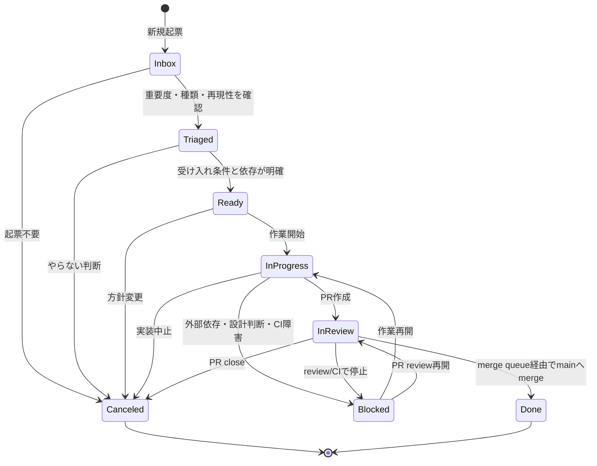

# Issue / PR lifecycle

# Status一覧

- Inbox
- Triaged
- Ready
- In Progress
- In Review
- Blocked
- Done
- Canceled

`Needs Info` と `Ready to Merge` は使わない。細かすぎる状態は更新負荷を増やし、agent運用で破綻しやすい。

# 状態遷移図



# Inbox

新規流入の置き場。

流入元:

- 人間の思いつき
- debug log
- チャット
- お問い合わせ
- agentの発見
- CI failure
- dependency alert
- security finding

Inboxでは実装しない。まずtriageする。

必須情報:

- Source
- 原文または要約
- 影響範囲
- 仮Priority
- 次に確認すべきこと

実行手順:

1. 流入元の原文、log、transcript、alert本文を読む。原文が長い場合も、要約だけでなく参照元を残す。
2. Sourceと仮PriorityはProject fieldへ置き、影響範囲はIssue本文またはcommentの自然文へ整理する。SourceやPriorityなどのfield assignmentは本文へ書かない。
3. 影響しているユーザー、機能、再現性、次に確認すべきことを書く。
4. Type、Scope、Size、Complexity、Risk、Agent TierをProject fieldへ仮設定できるか確認する。確定できない値は次のtriage確認事項として残す。
5. 実装は開始しない。Ready条件が揃わない場合はTriagedで止める。

# Triaged

分類済みだが、まだ作業できるとは限らない状態。

満たす条件:

- Typeがある。
- Scopeがある。
- Priority/Size/Complexity/Riskの仮値がある。
- epicまたは親Issueがある場合はsub-issueに入っている。
- 実行順序がある場合はblocked by / blockingがある。

実行手順:

1. Type、Scope、Priority、Size、Complexity、Risk、Agent TierをProject fieldで確認する。
2. epicまたは親Issueが必要な場合はsub-issueへ入れる。実行順序の依存はsub-issueではなくblocked by / blockingで表す。
3. Issue本文に受け入れ条件、非スコープ、確認手順、依存関係があるか確認する。
4. 影響範囲、再現性、実装対象が曖昧な場合は、Readyへ進めずTriagedのまま追加確認を残す。
5. Ready条件をすべて満たす場合だけReadyへ進める。

# Ready

agentまたは人間が作業開始できる状態。

満たす条件:

- 受け入れ条件がある。
- 非スコープがある。
- テストまたは確認手順がある。
- blocked byが解消済み、または作業開始に影響しない。
- Agent Tierが設定済み。

実行手順:

1. 受け入れ条件、非スコープ、確認手順が第三者に判定可能か読む。
2. blocked by / blockingをGitHub上の関係で確認する。未解決blockerが作業開始に影響する場合はReadyにしない。
3. Agent TierがProject fieldに設定済みか確認する。Agent Harness、Agent Model、Branchは作業開始時まで確定させなくてよい。
4. AssigneeまたはReviewer Ownerの責任者候補を確認する。まだ作業開始しない場合は、作業開始コメントを書かない。
5. かんばん上でReadyに置くのは、受け入れ条件、確認手順、blocker解消を確認済みのIssueだけにする。

# In Progress

作業中。

必須操作:

- Assigneeを設定する。
- agent自律作業でも、開発環境の持ち主またはreview責任者の人間をAssigneeにする。
- Agent Harnessを設定する。
- Agent ModelをProject fieldへ設定する。Issue本文とPR本文には書かない。
- Branchを設定する。
- Actual Startを設定する。
- linked branchを作る。

実行手順:

1. 作業開始直前にblocked byを再確認する。未解決blockerがある場合はIn Progressへ進めずBlockedへ戻す。
2. AssigneeとReviewer Ownerを確認し、agent自律作業でも人間の責任者を残す。
3. Agent Harness、Agent Model、Branch、Actual StartをProject fieldへ記録する。具体モデル名、branch名、日付fieldはIssue本文やPR本文へ書かない。
4. linked branchを作成し、Branch fieldとGitHub上のlinked branchが一致することを確認する。
5. 作業開始コメントを書く。担当者、agent情報、branchはProject fieldに記録済みであることだけを自然文で書く。

作業開始コメントの例:

```markdown
作業開始。

担当者、agent情報、branchはProject fieldに記録済み。
```

# In Review

PRが作成され、reviewとCIを待っている状態。

満たす条件:

- PRがある。
- PR本文にclosing keywordがある。
- 確認手順が書かれている。
- リスクが書かれている。
- 必要なreviewerが付いている。

実行手順:

1. PR state、base/head branch、linked Issue、closing keywordを確認する。
2. PR本文に概要、関連Issue、スコープ、確認手順、リスク、レビュー観点があるか確認する。具体モデル名やProject field metadataは本文へ書かない。
3. reviewer、review decision、unresolved conversation、requested changesを確認する。
4. CIは最新commit SHAのcheck結果を見る。失敗checkがrequiredか、optionalか、rerun中かを確認してから判断する。
5. PR作成日やmerge状態はGitHub PR metadataから読む。Project fieldへは複製しない。
6. required CI、review、権限、設計判断、外部依存で止まっている場合はBlockedへ移す。reviewやCIが通常の待ち状態ならIn Reviewのままにする。
7. review承認とrequired checksが揃ったらauto-mergeを有効化し、merge queueとmerge_group CIを待つ。

# Blocked

外部依存、設計判断、CI障害、review unresolved、権限不足で進めない状態。

Blockedにしたら必ず書く:

- 何でblockedか。
- 誰が解除できるか。
- どのIssue/PR/logに依存するか。
- 次の確認タイミング。

実行手順:

1. 何が進行を止めているかを確認する。未解決blocker、required CI失敗、review requested changes、権限不足、設計判断待ちを区別する。
2. Project StatusをBlockedへ更新する。StatusなどのProject field assignmentをcomment本文へ書かない。
3. commentには理由、解除できる人、依存Issue/PR/log、次の確認タイミングを書く。
4. blockerが解消したら、作業中PRがあるものはIn Reviewへ、未着手または作業再開前のものはReadyまたはIn Progressへ戻す前提条件を再確認する。

# Done

merge queue経由でmainへmergeされ、Issueがcloseした状態。

Done条件:

- PRがmainへmerge済み。
- linked Issueがclosed。
- Project StatusがDone。

実行手順:

1. PRがmainへmerge済みであることをPR state、merge commit、mergedAtで確認する。
2. linked Issueがclosing keywordまたは手動処理でclosedになっていることを確認する。
3. merge queueを使ったPRではmerge_group CIとrequired checksが通ったことを確認する。
4. Project fieldのActual Endに実終了日を記録し、StatusをDoneへ更新する。merge日やIssue close日はGitHub metadataから読む。
5. PR未merge、Issue open、merge日未確認のいずれかが残る場合はDoneにしない。

# Canceled

やらない判断。

理由をIssue commentまたは本文に残す。

- duplicated
- obsolete
- out of scope
- invalid
- replaced by another issue

実行手順:

1. なぜ実行しないかを確認する。duplicated、obsolete、out of scope、invalid、別Issueへ置換のいずれかに寄せる。
2. 代替Issue、duplicate元、方針変更の根拠がある場合はcommentにリンクする。
3. Project StatusをCanceledへ更新し、IssueまたはPRをcloseする場合はActual EndをProject fieldへ記録する。close日はGitHub metadataから読み、Project fieldへ複製しない。不要になったblocked by / blockingやsub-issue関係が残る場合は、混乱しないよう関係整理の要否を確認する。
4. 実装中PRがある場合は、PR closeが必要か、代替Issueへ引き継ぐかを確認してからCanceledにする。
