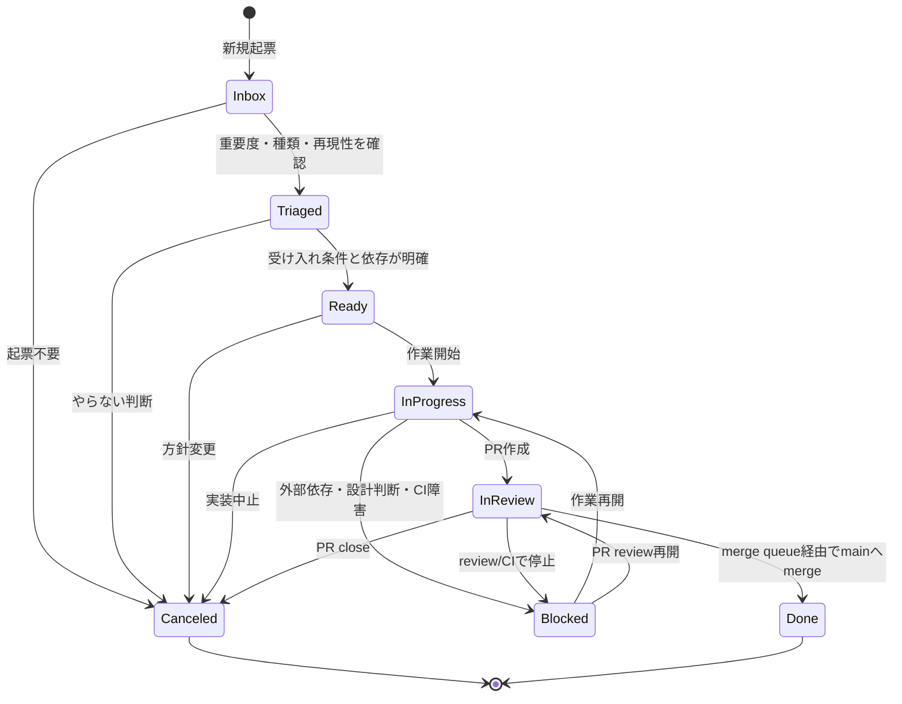

# Issue / PR lifecycle

# Status一覧

- Inbox
- Triaged
- Ready
- In Progress
- In Review
- Blocked
- Done
- Canceled

`Needs Info` と `Ready to Merge` は使わない。細かすぎる状態は更新負荷を増やし、agent運用で破綻しやすい。

# 状態遷移図



# Inbox

新規流入の置き場。

流入元:

- 人間の思いつき
- debug log
- チャット
- お問い合わせ
- agentの発見
- CI failure
- dependency alert
- security finding

Inboxでは実装しない。まずtriageする。

必須情報:

- Source
- 原文または要約
- 影響範囲
- 仮Priority
- 次に確認すべきこと

# Triaged

分類済みだが、まだ作業できるとは限らない状態。

満たす条件:

- Typeがある。
- Scopeがある。
- Priority/Size/Complexity/Riskの仮値がある。
- epicまたは親Issueがある場合はsub-issueに入っている。
- 実行順序がある場合はblocked by / blockingがある。

# Ready

agentまたは人間が作業開始できる状態。

満たす条件:

- 受け入れ条件がある。
- 非スコープがある。
- テストまたは確認手順がある。
- blocked byが解消済み、または作業開始に影響しない。
- Agent Tierが設定済み。

# In Progress

作業中。

必須操作:

- Assigneeを設定する。
- agent自律作業でも、開発環境の持ち主またはreview責任者の人間をAssigneeにする。
- Agent Harnessを設定する。
- Agent ModelをProject fieldへ設定する。Issue本文とPR本文には書かない。
- Branchを設定する。
- linked branchを作る。

作業開始コメントの例:

```markdown
作業開始。

担当者、agent情報、branchはProject fieldに記録済み。
```

# In Review

PRが作成され、reviewとCIを待っている状態。

満たす条件:

- PRがある。
- PR本文にclosing keywordがある。
- Verificationが書かれている。
- Riskが書かれている。
- 必要なreviewerが付いている。

# Blocked

外部依存、設計判断、CI障害、review unresolved、権限不足で進めない状態。

Blockedにしたら必ず書く:

- 何でblockedか。
- 誰が解除できるか。
- どのIssue/PR/logに依存するか。
- 次の確認タイミング。

# Done

merge queue経由でmainへmergeされ、Issueがcloseした状態。

Done条件:

- PRがmainへmerge済み。
- linked Issueがclosed。
- Project StatusがDone。

# Canceled

やらない判断。

理由をIssue commentまたは本文に残す。

- duplicated
- obsolete
- out of scope
- invalid
- replaced by another issue
