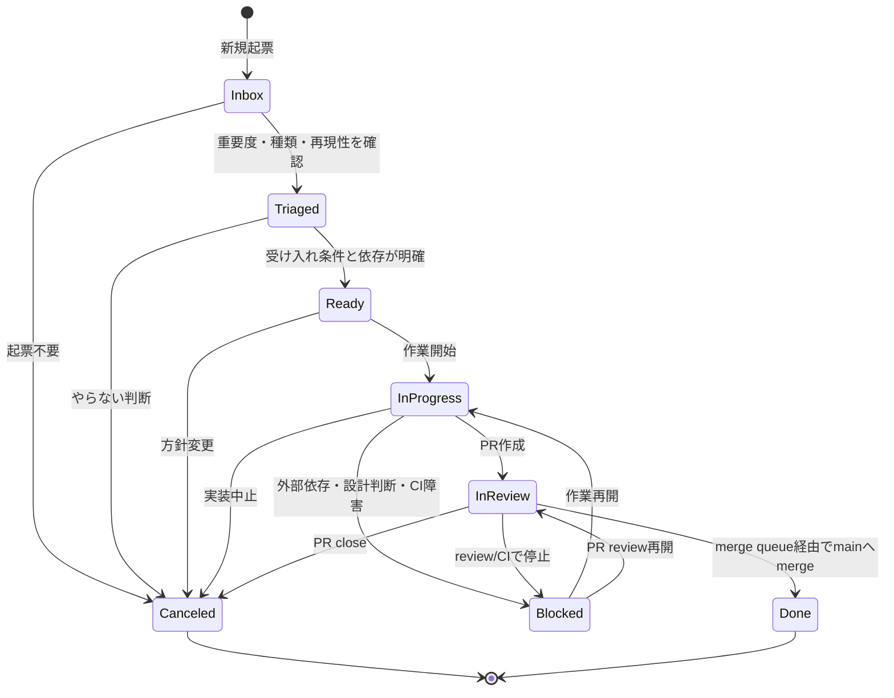

# Issue lifecycle

Status遷移、Ready/In Progress/In Review/Blocked判断、lifecycle commentを書くときに読む。

# 目次

- Status一覧
- 状態遷移図
- Status別実行手順
- Lifecycle comment templates
- Lifecycle comment examples

# Status一覧

- Inbox
- Triaged
- Ready
- In Progress
- In Review
- Blocked
- Done
- Canceled

`Needs Info` と `Ready to Merge` は使わない。細かすぎる状態は更新負荷を増やし、agent運用で破綻しやすい。

# 状態遷移図



# Status別実行手順

## Inbox

新規流入の置き場。Inboxでは実装しない。まずtriageする。

流入元:

- 人間の思いつき
- debug log
- チャット
- お問い合わせ
- agentの発見
- CI failure
- dependency alert
- security finding

必須情報:

- Source
- 原文または要約
- 影響範囲
- 仮Priority
- 次に確認すべきこと

実行手順:

1. 流入元の原文、log、transcript、alert本文を読む。原文が長い場合も、要約だけでなく参照元を残す。
2. Sourceと仮PriorityはProject fieldへ置き、影響範囲はIssue本文またはcommentの自然文へ整理する。SourceやPriorityなどのfield assignmentは本文へ書かない。
3. 影響しているユーザー、機能、再現性、次に確認すべきことを書く。必要ならInbox commentを使う。
4. Type、Scope、Size、Complexity、Risk、Agent TierをProject fieldへ仮設定できるか確認する。確定できない値は次のtriage確認事項として残す。
5. 実装は開始しない。Ready条件が揃わない場合はTriagedで止める。

## Triaged

分類済みだが、まだ作業できるとは限らない状態。

満たす条件:

- Typeがある。
- Scopeがある。
- Priority/Size/Complexity/Riskの仮値がある。
- epicまたは親Issueがある場合はsub-issueに入っている。
- 実行順序がある場合はblocked by / blockingがある。

実行手順:

1. Type、Scope、Priority、Size、Complexity、Risk、Agent TierをProject fieldで確認する。
2. epicまたは親Issueが必要な場合はsub-issueへ入れる。実行順序の依存はsub-issueではなくblocked by / blockingで表す。
3. Issue本文に受け入れ条件、非スコープ、確認手順、依存関係があるか確認する。
4. 影響範囲、再現性、実装対象が曖昧な場合は、Readyへ進めずTriagedのまま追加確認を残す。必要ならTriaged commentを使う。
5. Ready条件をすべて満たす場合だけReadyへ進める。

## Ready

agentまたは人間が作業開始できる状態。

満たす条件:

- 受け入れ条件がある。
- 非スコープがある。
- テストまたは確認手順がある。
- blocked byが解消済み、または作業開始に影響しない。
- Agent Tierが設定済み。

実行手順:

1. 受け入れ条件、非スコープ、確認手順が第三者に判定可能か読む。
2. blocked by / blockingをGitHub上の関係で確認する。未解決blockerが作業開始に影響する場合はReadyにしない。
3. Agent TierがProject fieldに設定済みか確認する。Agent Harness、Agent Model、Branchは作業開始時まで確定させなくてよい。
4. AssigneeまたはReviewer Ownerの責任者候補を確認する。まだ作業開始しない場合は、作業開始コメントを書かない。
5. かんばん上でReadyに置くのは、受け入れ条件、確認手順、blocker解消を確認済みのIssueだけにする。判断が揺れやすい場合はReady commentを使う。

## In Progress

作業中。

必須操作:

- Assigneeを設定する。
- agent自律作業でも、開発環境の持ち主またはreview責任者の人間をAssigneeにする。
- Agent Harnessを設定する。
- Agent ModelをProject fieldへ設定する。Issue本文とPR本文には書かない。
- Branchを設定する。
- Actual Startを設定する。
- linked branchを作る。

実行手順:

1. 作業開始直前にblocked byを再確認する。未解決blockerがある場合はIn Progressへ進めずBlockedへ戻す。
2. AssigneeとReviewer Ownerを確認し、agent自律作業でも人間の責任者を残す。
3. Agent Harness、Agent Model、Branch、Actual StartをProject fieldへ記録する。具体モデル名、branch名、日付fieldはIssue本文やPR本文へ書かない。
4. linked branchを作成し、Branch fieldとGitHub上のlinked branchが一致することを確認する。
5. In Progress commentを使って作業開始を記録する。

## In Review

PRが作成され、reviewとCIを待っている状態。

満たす条件:

- PRがある。
- PR本文にclosing keywordがある。
- 確認手順が書かれている。
- リスクが書かれている。
- 必要なreviewerが付いている。

実行手順:

1. PR state、base/head branch、linked Issue、closing keywordを確認する。
2. PR本文に概要、関連Issue、スコープ、確認手順、リスク、レビュー観点があるか確認する。具体モデル名やProject field metadataは本文へ書かない。
3. reviewer、review decision、unresolved conversation、requested changesを確認する。
4. CIは最新commit SHAのcheck結果を見る。失敗checkがrequiredか、optionalか、rerun中かを確認してから判断する。
5. PR作成日やmerge状態はGitHub PR metadataから読む。Project fieldへは複製しない。
6. required CI、review、権限、設計判断、外部依存で止まっている場合はBlockedへ移す。reviewやCIが通常の待ち状態ならIn Reviewのままにする。
7. PR本文とclosing keywordで追跡でき、特筆事項がなければcommentを書かない。PR本文やGitHub metadataでは分からない一時的な補足がある場合だけ、In Review commentを使う。
8. review承認とrequired checksが揃ったらauto-mergeを有効化し、merge queueとmerge_group CIを待つ。

## Blocked

外部依存、設計判断、CI障害、review unresolved、権限不足で進めない状態。

Blockedにしたら必ず書く:

- 何でblockedか。
- 誰が解除できるか。
- どのIssue/PR/logに依存するか。
- 次の確認タイミング。

実行手順:

1. 何が進行を止めているかを確認する。未解決blocker、required CI失敗、review requested changes、権限不足、設計判断待ちを区別する。
2. Project StatusをBlockedへ更新する。StatusなどのProject field assignmentをcomment本文へ書かない。
3. Blocked commentを使い、理由、解除できる人、依存Issue/PR/log、次の確認タイミングを書く。解除できる人はrepo内collaboratorならGitHub mention、project/repository外のGitHub accountならprofile URL、GitHub accountがない場合はSlack/Teams profile URLまたは氏名で特定し、外部依存は必ずURL付きにする。
4. blockerが解消したら、作業中PRがあるものはIn Reviewへ、未着手または作業再開前のものはReadyまたはIn Progressへ戻す前提条件を再確認する。必要ならUnblocked / resume commentを使う。

## Done

merge queue経由でmainへmergeされ、Issueがcloseした状態。

Done条件:

- PRがmainへmerge済み。
- linked Issueがclosed。
- Project StatusがDone。

実行手順:

1. PRがmainへmerge済みであることをPR state、merge commit、mergedAtで確認する。
2. linked Issueがclosing keywordまたは手動処理でclosedになっていることを確認する。
3. merge queueを使ったPRではmerge_group CIとrequired checksが通ったことを確認する。
4. Project fieldのActual Endに実終了日を記録し、StatusをDoneへ更新する。merge日やIssue close日はGitHub metadataから読む。
5. Done commentを使い、merge、close、checks、follow-upを記録する。
6. PR未merge、Issue open、merge日未確認のいずれかが残る場合はDoneにしない。

## Canceled

やらない判断。理由をIssue commentまたは本文に残す。

理由:

- duplicated
- obsolete
- out of scope
- invalid
- replaced by another issue

実行手順:

1. なぜ実行しないかを確認する。duplicated、obsolete、out of scope、invalid、別Issueへ置換のいずれかに寄せる。
2. Canceled commentを使い、代替Issue、duplicate元、方針変更の根拠がある場合はcommentにリンクする。
3. Project StatusをCanceledへ更新し、IssueまたはPRをcloseする場合はActual EndをProject fieldへ記録する。close日はGitHub metadataから読み、Project fieldへ複製しない。不要になったblocked by / blockingやsub-issue関係が残る場合は、混乱しないよう関係整理の要否を確認する。
4. 実装中PRがある場合は、PR closeが必要か、代替Issueへ引き継ぐかを確認してからCanceledにする。

# Lifecycle comment templates

Project field metadata、具体モデル名、branch名はcomment本文へ書かない。必要なら「Project fieldに記録済み」とだけ書く。

冒頭の絵文字付き一文で状態を示し、その後に必要なキーだけを書く。

## Inbox comment

```markdown
📥 流入内容を整理した。

流入元: ... (URL)
要約: ...
影響: ...
次に確認すること: ...
```

## Triaged comment

```markdown
🔎 トリアージした。

判断根拠:

- ...

未確定事項: なし / ...
Readyへ進めない理由: なし / ...
```

Readyへ進められる場合は、Ready commentを使う。未確定事項がない場合は `なし` と書く。

## Ready comment

明白な場合は省略してよい。判断が揺れやすいIssue、重要Issue、blocker解消直後のIssueでは残す。

```markdown
🟢 Ready状態になった。

確認済み:

- 受け入れ条件が判定可能
- 非スコープが明確
- 確認手順がある
- 作業開始を止めるblockerがない

補足: なし / ...
```

## In Progress comment

```markdown
🚧 作業中の補足。

担当者、agent情報、branch、実作業開始日はProject fieldに記録済み。

作業前確認:

- blockerを再確認済み
- linked branchを確認済み

メモ: なし / ...
```

## In Review comment

通常は書かない。PR bodyに概要、関連Issue、スコープ、確認手順、リスク、レビュー観点を書き、`Closes #...` / `Fixes #...` / `Resolves #...` による自動追跡に任せる。

PR bodyやGitHub metadataで分かる内容をcommentへ重複させない。reviewerへの一時的な補足、CIの特殊事情、外部判断待ち、通常と違う確認依頼がある場合だけ書く。

```markdown
👀 特筆事項があるため、In Review commentを残す。

PR本文やGitHub metadataでは分からないこと: ...
一時的な注意点: ...
次に見るもの: PR checks / review thread / 外部URL
```

## Blocked comment

`解除できる人` はproject/repository内のGitHub collaboratorならGitHub mentionを書く。upstream maintainerなどproject/repository外のGitHub accountはmentionせず、GitHub profile URLまたは該当Issue/PR URLで書く。GitHub accountがない場合はSlack/TeamsのプロフィールURL、または氏名を書く。

外部依存は必ずURL付きで書く。Issue/PR、CI run、log、Figma frame、Slack/Teams thread、外部trackerなど、後から同じ対象を開ける参照にする。

```markdown
⛔ ブロックに変更した。

理由: ...
解除できる人: @repo-collaborator / GitHub profile URL / Slack profile URL / Teams profile URL / 氏名
依存: #... / 外部依存URL
次の確認タイミング: ...
```

## Unblocked / resume comment

```markdown
🔓 ブロックが解消した。

解消内容: ...
戻す状態: ...
再確認したこと: ...
```

## Done comment

```markdown
✅ 完了確認。

確認済み:

- PRがmainへmerge済み
- linked Issueがclose済み
- required checksが通過済み
- 実終了日はProject fieldに記録済み

残follow-up: なし / #...
```

## Canceled comment

```markdown
🛑 Canceledにします。

理由: duplicated / obsolete / out of scope / invalid / replaced
根拠: ...
代替または関連Issue: なし / #...
```

# Lifecycle comment examples

## Inbox

```markdown
📥 流入内容を整理した。

流入元: 問い合わせフォームから、検索結果がなぜ一致したか分からないという報告があった。 (https://example.com/form/post/123)
要約: 検索結果カードに動画全体の情報だけが出ており、一致したシーンの説明やセリフが見えない。
影響: 検索結果を見ても、目的の場面かどうか判断しづらい。
次に確認すること: 一致シーンの説明、タグ、セリフ抜粋をAPIから取得できるか確認する。
```

## Triaged

```markdown
🔎 トリアージした。

判断根拠:

- 1つのカード表示改善として分離できる。
- 検索rankingやプレイヤーの挙動は変更しなくてよい。

未確定事項: 一致シーンの説明がない既存データのfallback表示を決める必要がある。
Readyへ進めない理由: fallback表示が未決定。
```

## Ready

```markdown
🟢 Ready状態になった。

確認済み:

- 受け入れ条件が判定可能
- 非スコープが明確
- 確認手順がある
- 作業開始を止めるblockerがない

補足: fallbackは「未取得」と表示する方針に決定済み。
```

## In Progress

```markdown
🚧 作業中の補足。

作業中に悩んだこと、メモ、ログなどをタスクに合わせて必要に応じて残す。
```

## In Review

```markdown
👀 特筆事項がないため、In Review commentは省略する。

基本的には書かない。PRやGitHub metadataで分かる内容をcommentへ重複させない。
```

## Blocked

```markdown
⛔ ブロックに変更した。

理由: fixtureに一致シーンの説明がないケースが不足しており、fallback表示確認ができない。
解除できる人: @fixture-owner
依存: fixture追加PR https://github.com/example/search-ui/pull/219
次の確認タイミング: fixture追加PRのcheck完了後。
```

## Unblocked / resume

```markdown
🔓 ブロックが解消した。

解消内容: fixtureに一致シーン説明なしのケースが追加された。
戻す状態: review再開。
再確認したこと: fallback表示の確認手順をPR本文に反映済み。
```

## Blocked: upstream PR待ち

```markdown
⛔ ブロックに変更した。

理由: 依存ライブラリの不具合修正がupstreamでreview中で、mergeされるまでこちらの実装を確定できない。
解除できる人: upstream maintainer https://github.com/upstream-maintainer

依存:

- upstream修正PR: https://github.com/example/video-search-sdk/pull/482
- Issue: https://github.com/example/video-search-ui/issues/123

次の確認タイミング: upstream PRのreview更新後、または翌営業日。
```

## Unblocked / resume: upstream PR merge

```markdown
🔓 ブロックが解消した。

解消内容: upstream修正PRがmergeされ、依存ライブラリ側の修正方針が確定した。
戻す状態: 作業再開。
再確認したこと:

- こちらの実装方針がupstreamの修正内容と矛盾していない。
- 依存バージョン更新の要否をPR本文の確認手順に反映済み。
```

## Blocked: Figma確定待ち

```markdown
⛔ ブロックに変更した。

理由: 検索結果カードの密度とfallback表示の見た目がFigma上で未確定のため、UI実装を確定できない。
解除できる人: Figma owner: https://teams.microsoft.com/l/person/48:notes/00000000-0000-0000-0000-000000000000
依存: Figma design: https://www.figma.com/design/AbCdEfGhIj/Search-Results?node-id=12-34
次の確認タイミング: Figmaの該当frameが確定した後。
```

## Unblocked / resume: Figma確定

```markdown
🔓 ブロックが解消した。

解消内容: Figma上で検索結果カードの密度、fallback表示、長い商品名の折り返し方針が確定した。
戻す状態: 作業再開。
再確認したこと:

- Issue bodyの受け入れ条件を確定デザインに合わせて更新済み。
- 古い表示方針はdetailsに移して、現在の確認手順と混ざらないようにした。
```
