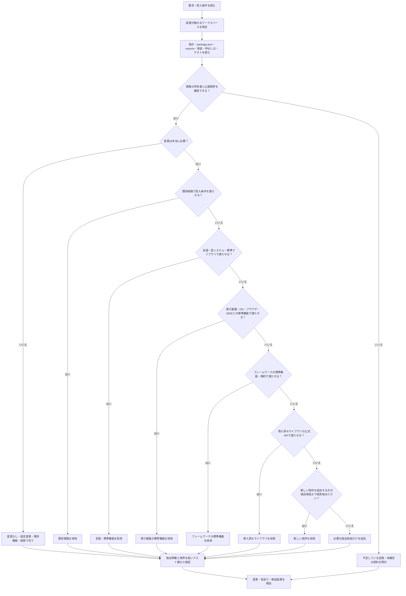

# 最小実装

## 適用方針

目的は、要求、受入条件、安全性、互換性、必要な検証を保ちながら、テスト対象となる独自実装量を削減し、
メンテナンスコストを削減することである。対象はコードの行数ではなく、プロジェクトが所有して理解・保守・
検証する次の総量である。

- 独自の分岐、状態、変換、抽象化、依存関係、設定
- 重複した知識、実装、契約、変更時に同時確認が必要な箇所
- テスト対象となる独自挙動、fixture、mock、起動経路
- workspace間の結合、境界を越えるimport、運用上の負担

最初に問題を理解し、要求を完全に満たす最初の成立手段で止める。最小差分を理由に要件、
安全策、エラー処理、データ保全、アクセシビリティ、互換性、性能、必要なテストを削らない。

## 入力の解釈

- 通常の依頼は実装手順を適用する。
- `review` が指定されたら現在の差分または指定範囲だけをレビューする。
- `audit` が指定されたらリポジトリまたは指定範囲を横断して候補を監査する。
- 操作が明記されていなければ、ユーザーの主目的に従う。

```text
$minimum-impl 認証済みユーザーだけが設定を更新できるようにする
$minimum-impl review
$minimum-impl audit apps/api
```

## 実装前に読むもの

理解を省略して短い差分を作らない。次の順に、必要な範囲を実物で確認する。

1. 要求、受入条件、変更してはならない挙動、非対象を整理する。
2. root と対象ディレクトリの `AGENTS.md`、local skill、対象を指定する docs、ADR、test contract を読む。
3. 使用する言語、ランタイム、プラットフォーム、フレームワーク、ライブラリの対象バージョンに対応する
   公式仕様、公式docs、公式examplesを読む。推奨される慣例フォルダ構造、命名、公開entrypoint、設定、
   コード例を確認し、公式に明記がなければ対象リポジトリの既存採用例を正本として踏襲する。公式docsや
   既存例にない独自の構造、wrapper、呼出し方を先に設計しない。
4. monorepo では root の `package.json`、workspace定義、task runner設定、各対象 workspace の
   `package.json`、`exports`、`tsconfig`、test/lint/typecheck/build script を読む。実際の依存グラフと
   公開entrypointを確認し、workspace名やディレクトリ名を推測しない。
5. 変更対象の実装、全呼出し元、データフロー、設定、依存関係、既存テスト、現在の差分、対象SHAを読む。
6. `review` と `audit` は、最初に対象SHA・working tree・差分ファイルを確認する。シナリオや説明に
   書かれた変更が実在しなければ、存在すると仮定して指摘せず、確認できた所見と不足証拠を分ける。

受入条件が状態モデル、role matrix、tenant境界、失敗分類、公開response、互換性、データ保全を左右する
場合、未確定の選択を実装済みの仕様として埋めない。回答を待たないと安全に決められないなら確認事項を
提示して止める。安全な範囲で先に進める場合も、確定事項、仮定、仮定が変わると影響するfile・test・契約を
明示し、仮定を受入条件や成功した検証結果として報告しない。`review` と `audit` では、欠けている証拠や
契約も指摘する。

Web/API/DB/Worker/Agentをまたぐ実装案を確定する前には、次の読了を最低条件にする。読み取り専用や差分の
小ささはこのgateを免除しない。

- 各対象workspaceの指示、manifest、`exports`、依存方向、検証script
- 各workspaceの責務を実装している公開entrypoint、変更対象の所有実装、全callerとデータフロー
- 既存の関連testと、再利用するclient・schema・component・query・factory
- 認証・認可・tenant mutationなら、permission正本、membership/role判定、resource query、error契約
- DB mutationなら、schema、migration運用、repository adapter、transaction・audit・rollback経路

一つでも未確認なら、追加探索を打ち切って確定案を出さない。確認できた範囲のprovisionalな案、未確認の
file・契約、設計を変え得る理由、次に読むべき箇所を分けて報告する。

## 選択順序

問題を理解した後、次の順で最初に受入条件を満たす手段を選ぶ。

1. 変更しない、設定だけ変える、既存機能を呼ぶ、不要コードを削除する。
2. 同じコードベースの既存関数、型、component、schema、query、client、factory、設定、公開entrypointを再利用する。
3. 言語、ランタイム、型システム、標準ライブラリ、標準ツールを使う。
4. OS、ブラウザ、HTML、CSS、SQL、DB制約などのプラットフォーム機能を使う。
5. フレームワークの標準機能、規約、設定、extension pointを使う。
6. 導入済みライブラリの公式APIと設定を使う。
7. 新しい依存関係と小さな独自実装を、保守、試験、供給網、更新、bundle、実行環境を含む総負担で比較する。
8. それでも必要な場合だけ、要求を満たす最小の独自実装を追加する。

同じ結果でも、標準機能と独自実装を重ねない。標準機能の内部を再試験せず、プロジェクト固有の設定、
境界条件、統合だけを検証する。bug fixは症状の呼出し側に散らさず、全呼出し元を確認して共通の根因と
共有経路に一度だけ修正する。ただし、共有変更が既存利用者の挙動を変える場合はその影響を検証する。

## DRY

DRYは同じ知識や変更理由を複数箇所に持たせないために使う。業務規則、schema、validation、対応表、
定数、serialization、error mappingの正本を一つにする。同じ理由で同時に変更される実装は共通化し、
既存の共通経路を拡張できるなら並行実装を作らない。

ただし、見た目が似ているだけで意味や変更理由が違うものは統合しない。共通化によって引数、分岐、
間接参照、型の複雑さ、テストfixture、理解コストが増えるなら、局所的な重複を許容する。重複を解消したら、
置換された旧実装と不要な互換経路を削除する。

transport contract、domain model、UI入力validationは意味が違う場合がある。重複を指摘するときは、
canonicalな契約とUI専用の検証を区別し、同じ知識を複数の実行時schemaへ複製している証拠を確認する。

## YAGNI

現在確認できる要求、受入条件、実在する呼出し元、実装済みvariantに不要な将来機能を作らない。
具体的な根拠なしに次を追加しない。

- 一つしかない実装を隠すinterface、adapter、wrapper、service、repository
- 将来用のprovider、plugin、extension point、config、feature flag、migration/compatibility layer
- 全workspaceを覆うgeneric `Result`、base class、registry、DI container
- 未使用の公開API、代替経路、共通package、抽象化

将来計画やアイデアは現在の受入条件ではない。将来本当に必要になった時点で、variant、共有する意味論、
security影響、失敗契約、契約test、移行手順を確定してから追加する。

## 許容するレイヤー分割

テストを簡単、速く、決定的にするための分割は許容する。純粋な業務判断とネットワーク、DB、filesystem、
時刻、乱数、環境変数などの副作用、または入力検証・domain処理・出力serializationを分けてもよい。
ただし、次をすべて確認する。

- 中核ロジックを直接かつ簡単に単体テストできる。
- I/O側が薄く、domain側へframework固有型やconcrete providerを漏らさない。
- fixture、mock、分岐、総コード量、理解コストの少なくとも一つが実際に減る。
- 引数と戻り値を横流しするだけのservice/repository/use case層を増やさない。
- DIは実在する副作用境界または差し替え対象に限定する。

portはそれを使うapplication/moduleが所有する。複数runtimeで形だけ似たportを一つのgeneric contractへ
揃えない。同じ意味論を持つ同一境界だけを局所的に正規化する。

## 許容するファクトリーパターン

factoryは、実在する複数種類の生成、識別値からの選択、反復するfixture生成を一箇所へ集約し、可読性を
上げながら総コード量または重複分岐を減らす場合に許容する。データ駆動の定義で条件分岐を減らす場合もよい。

次は許容しない。

- 将来の種類だけを理由にしたfactory、registry、builder、containerの連鎖
- 直接constructorを呼ぶより長く不透明なfactory
- 一つの値をそのまま返すだけで、コード量も可読性も改善しないfactory

一種類でも、反復するテストfixtureや複雑な既定値を実質的に減らし、呼出し側の意図を明確にするなら許容する。

## 実装と検証

1. 要求、受入条件、不変条件、非対象、workspaceごとの所有者を短く書く。
2. 既存の標準機能、公開entrypoint、共通経路、呼出し元、testを探し、選択順序で採用案を一つに絞る。
3. 根因のある所有境界へ小さく一貫した差分を入れる。無関係な整理、将来用の一般化、新しい依存を混ぜない。
4. 置換された重複、未使用コード、不要なwrapper、古い互換経路を削除する。ただし既存利用者の挙動を先に確認する。
5. 独自の分岐、変換、状態遷移、権限判定、外部境界との契約、回帰対象を、最も低い適切なtest layerで検証する。
6. まず対象workspaceのtest/typecheck/lint/format check、次に依存するworkspace、最後にrootのcheckやbuildへ広げる。
   実行commandはリポジトリ既存のscriptと指示に従い、変更に不要な高価なbrowser・E2E・paid testを推測で足さない。
7. 失敗時は原因を特定して修正し、成功した検証と未実行の検証、その理由を報告する。テストを削って成功扱いにしない。

最終報告は次の形を基本とする。

```text
採用: 標準機能、既存実装、公開entrypoint、選択理由
変更: workspaceごとのfileと責務
削除/見送り: 重複、wrapper、将来用一般化と理由
安全性: 認証、tenant、transaction、error、互換性への影響
検証: 実行したcommandと結果、未実行のcommandと理由
残る独自実装: 要求に必要なものだけ
```

## 差分レビュー

`review`では、現在の対象SHAと差分を確認したうえで、最小実装の観点に限定する。次を、呼出し元、
公開exports、依存実態、既存testで裏付ける。

- 標準機能、framework機能、導入済みlibrary、既存clientの再実装
- DRY違反となるdomain規則、schema、validation、対応表、error mappingの重複
- YAGNI違反となる未使用の一般化、将来用拡張点、過剰な依存や設定
- 引数と戻り値を横流しするwrapper、layer、interface、DI
- 副作用混在でtestを難しくしている構造
- factoryで明確に削減できる実在種類の生成重複、またはfactory自体の過剰化
- monorepoのworkspace責務、公開entrypoint、deep import、禁止された依存方向の違反

各指摘には優先度、実在するfile:line、証拠、増えた独自実装・保守負担、より単純な代替案、挙動・互換性・
testへの影響を含める。存在しない差分やlineを推測しない。条件を満たすpure logic/I/O分離や実在する
複数種類のfactoryは、単にレイヤーやfactoryがあるという理由だけで問題にしない。該当事項がなければ、
最小実装の観点で重大な問題はないと明記する。このレビューは正確性、security、performanceの総合レビューの代替ではない。

## リポジトリ監査

`audit`では、指定範囲を横断して候補を証拠付きで優先順位付けする。各候補について、対象、利用実態、
現状の独自実装・保守負担、標準機能または既存経路への置換案、削減できる独自実装、移行リスク、必要なtest、
変更順序を示す。workspace境界を越える提案では、公開entrypointと責務所有者を明記する。

推測だけの指摘をしない。監査結果の提示だけを求められた場合は自動的に大規模変更を開始せず、ユーザーが
実装も求めた場合だけ、合意した範囲を実装する。

---

## TypeScript フルスタック・モノレポの判断の流れ

具体的な製品名や業務領域ではなく、要求に現れる責務をワークスペースの所有者へ写像する。実際の
ワークスペース名、公開entrypoint、依存方向、検証scriptは対象リポジトリから確認し、以下を判断の型として
使う。例の名前や構造をそのまま作らない。



### ワークスペース責務の写像

| 要求に現れる責務                                        | まず読むワークスペース・境界               | 実装の置き場所と避けること                                                                                |
| ------------------------------------------------------- | ------------------------------------------ | --------------------------------------------------------------------------------------------------------- |
| 画面、ルーティング、ブラウザ状態、UI入力                | Webとその公開API client                    | Webに置く。DB、認証の正本、別runtimeの内部実装へ深いimportをしない。                                      |
| 公開HTTP契約、認証・認可、tenant境界、業務状態の判断    | API / server                               | APIの公開routeと既存の業務経路を拡張する。画面側へ権限判定や業務規則を複製しない。                        |
| schema、制約、migration、repository、transaction、audit | DBを所有するserver / data workspace        | 既存のschema・migration・repository・transaction経路を使う。routeからDB adapterを直接増やさない。         |
| queue、定期処理、Agent、専用Workerなどの固有runtime     | 要件が実際に触れるWorker / Agent workspace | データフローと公開契約が必要な時だけ変更する。要件に登場しないruntimeは変更しない。                       |
| 複数consumerが実際に使うドメイン非依存の型・契約        | 既存の共有packageと公開exports             | 実際の重複と共有する意味論がある時だけ置く。feature固有UI、認可、DB query、route schemaの箱を新設しない。 |

### 汎用例: 複数ワークスペースをまたぐ更新要求

例えば「Webの入力を受け、サーバー上のリソースを検証して保存する」という要求では、要求された挙動を
次のように分解する。

1. Webは、既存の画面、ルーティング、フォーム状態、対象リソース専用のAPI clientを確認する。画面だけの
   表示・入力・pending/error表示で完結するなら、APIやDBへ新しい経路を追加しない。
2. APIは、公開transport、入力の境界、認証・認可、tenant境界、業務状態の判断、エラー契約を所有する。
   既存のservice、純粋な判断、repository、transactionがあればそれをつなぎ、同じ検証をWebへ複製しない。
3. DBやdata workspaceは、保存にschema、制約、migration、query、transactionの変更が本当に必要な時だけ
   触る。既存schemaとqueryで満たせるなら、テーブルやrepositoryの抽象を追加しない。
4. WorkerやAgentは、非同期処理、専用runtime、tool実行などが受入条件やデータフローに含まれる場合だけ
   公開境界を通して変更する。WebやAPIからruntime内部を深いimportで再利用しない。
5. 2つ以上のconsumerが同じドメイン非依存契約を必要とし、共有すると重複と変更点を減らせる場合だけ
   既存の共有packageへ追加する。一つのconsumerのために共通化しない。

この写像で追加する独自実装は、要求固有の判断と既存境界をつなぐ薄い統合に限る。ワークスペース名や
フレームワーク名が違っても、所有者、公開entrypoint、依存方向、データフロー、最も低い適切なテスト層を
確認して同じ判断を行う。
